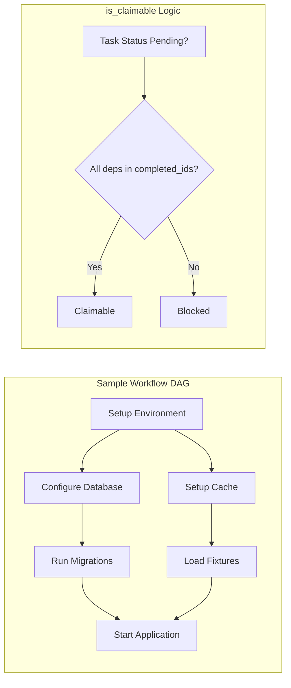

# Task Dependency Management

### From: task

Task dependency management in the ragent system enables modeling of workflows where certain tasks must complete before others can begin, implemented through the `depends_on` field in the Task struct and the `is_claimable()` validation logic. This concept transforms a simple task queue into a directed acyclic graph (DAG) of work items, where edges represent prerequisite relationships. The implementation is intentionally lightweight—dependencies are stored as string IDs referencing other tasks, with satisfaction checked at claim time rather than enforced through database foreign keys or complex graph validation.

The dependency resolution algorithm is straightforward but effective: when evaluating if a task is claimable, the system collects all completed task IDs into a set, then verifies that every ID in `depends_on` is present in that set. This O(n*m) check (where n is task count and m is average dependencies) is acceptable for typical task list sizes. The design choice to check dependencies only at claim time, rather than maintaining a running graph state, simplifies persistence and recovery—there's no separate dependency index to corrupt or rebuild. However, this means cyclic dependencies are not proactively detected; a cycle would simply result in tasks that can never be claimed.

The power of this approach emerges in the `claim_next()` operation, which automatically finds the first task whose dependencies are satisfied. This enables pull-based workflow patterns where agents request work and receive appropriately unblocked tasks. When `complete()` is called, dependent tasks don't immediately transition—they become claimable on the next evaluation. This lazy propagation matches the file-based persistence model where we want to minimize write operations. For team leads, dependencies enable sophisticated workflow design: initialization tasks, parallel workstreams that merge at integration points, and quality gates that block deployment until verification completes.

## Diagram

## External Resources

- [Directed acyclic graph mathematical structure underlying task dependencies](https://en.wikipedia.org/wiki/Directed_acyclic_graph) - Directed acyclic graph mathematical structure underlying task dependencies
- [DAG-based workflow systems in modern data orchestration (conceptual comparison)](https://docs.dagster.io/concepts/ops-jobs-graphs/jobs) - DAG-based workflow systems in modern data orchestration (conceptual comparison)

## Sources

- [task](../sources/task.md)
