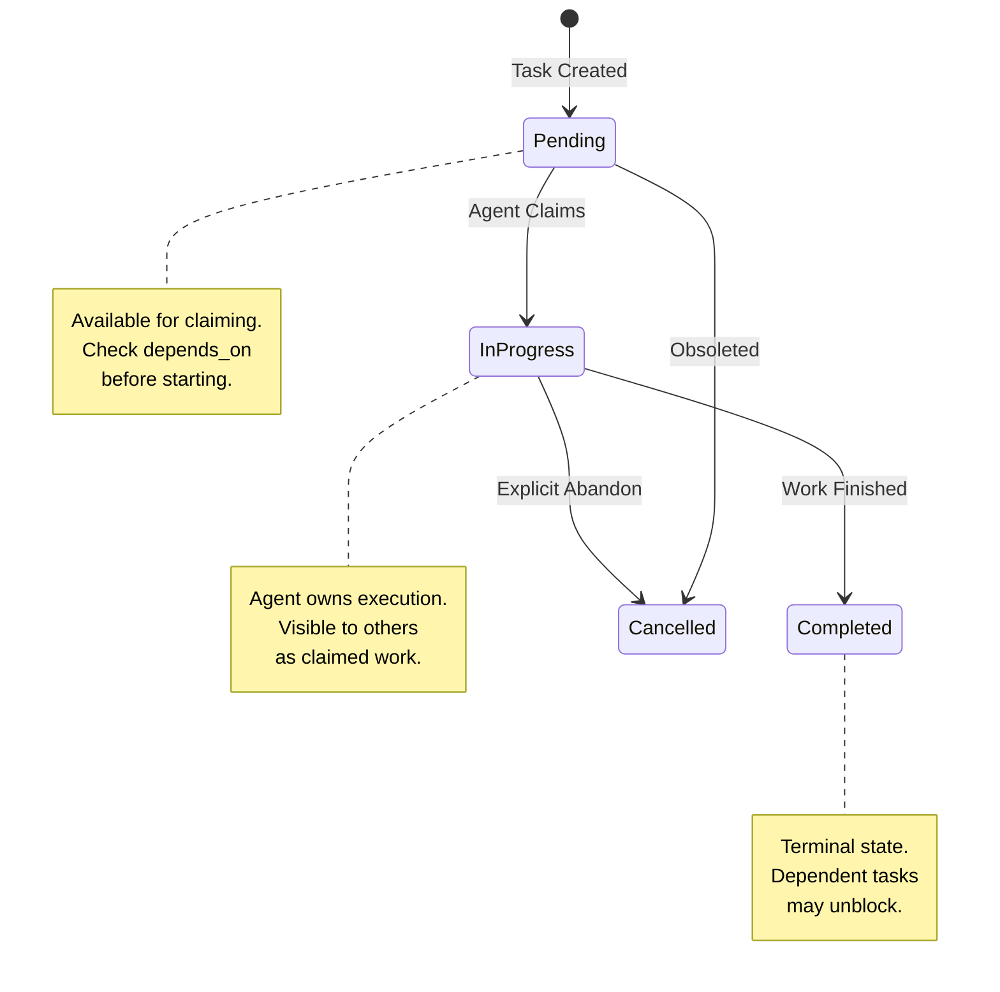

# Task State Management in Multi-Agent Systems

### From: team_task_list

Task state management in multi-agent systems addresses the fundamental coordination challenge: how do independent agents maintain shared understanding of work status, ownership, and dependencies without centralized orchestration? The ragent-core approach exemplifies a "coordination through data" pattern where TaskStore provides a neutral persistence layer that any authorized agent can read and modify. This architecture decouples agents from direct communication requirements, replacing message-passing complexity with observable state transitions. The task lifecycle—Pending, InProgress, Completed, Cancelled—establishes a simple protocol that agents can interpret to understand available work and current blockers.

The design choices in TeamTaskListTool reveal assumptions about multi-agent interaction patterns. The inclusion of assigned_to and depends_on fields supports work distribution and dependency tracking without requiring agents to negotiate directly. An agent discovering available tasks can filter for unassigned Pending tasks, claim ownership through state update, and respect dependency constraints by checking depends_on before execution. The read-only nature of this specific tool reflects a query-responsibility-separation pattern: task modification likely occurs through separate tools (team_task_create, team_task_update) with appropriate permission categories, while listing remains broadly accessible for situational awareness.

Comparison with alternative coordination models illuminates these tradeoffs. Centralized orchestrators (like Kubernetes controllers or workflow engines) provide strong consistency guarantees but introduce single points of failure and scaling bottlenecks. Pure message-passing systems (actor models, pub/sub) offer flexibility but complicate recovery from dropped messages and require complex consensus for shared state. The ragent filesystem-backed approach occupies a middle ground: durability through write-ahead logging implicit in modern filesystems, observability through standard tools, and eventual consistency acceptable for many agent workflows. Limitations include potential conflicts from concurrent writes and latency from polling-based discovery, addressed in production systems through file locking primitives and change notification mechanisms. This pattern suits domains where agents operate relatively independently with clear task boundaries, rather than tightly-coupled collaborative workflows requiring real-time synchronization.

## Diagram

## External Resources

- [Dryad: Distributed Data-Parallel Programs from Sequential Building Blocks](https://www.microsoft.com/en-us/research/publication/dryad-distributed-data-parallel-programs-sequential-building-blocks/) - Dryad: Distributed Data-Parallel Programs from Sequential Building Blocks
- [The Raft Consensus Algorithm for distributed state machine coordination](https://raft.github.io/) - The Raft Consensus Algorithm for distributed state machine coordination

## Sources

- [team_task_list](../sources/team-task-list.md)
