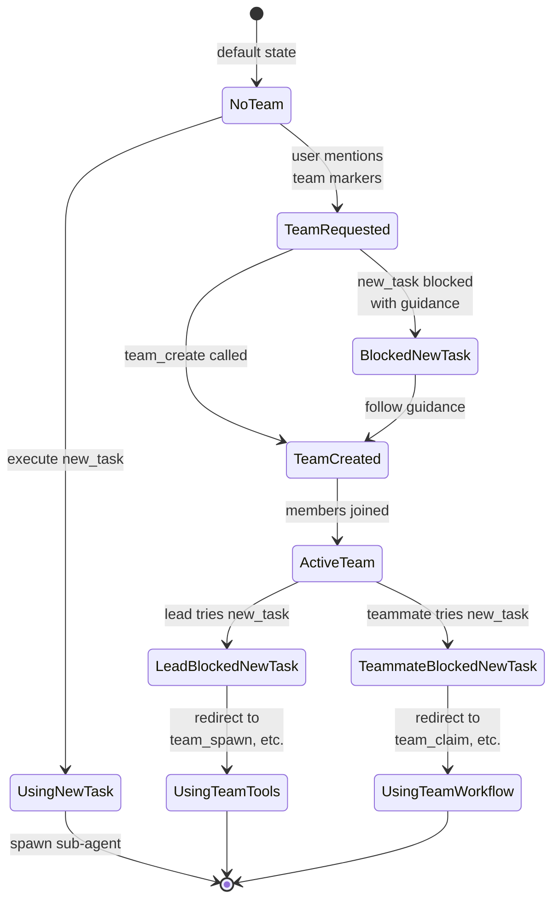

# Team Context Detection

### From: new_task

Team context detection is a workflow routing mechanism that prevents architectural confusion between individual sub-agent delegation and structured team collaboration. The implementation employs multi-layered detection: checking active `team_context` membership, and heuristically analyzing recent user messages for collaboration intent. This defensive design recognizes that users may naturally express team desires using varied language, and that premature `new_task` usage would create session topology incompatible with subsequent team formation.

The active detection path examines `ctx.team_context`, an optional structure containing `team_name`, `agent_id`, and `is_lead` boolean. When present, the tool completely blocks execution with contextualized guidance. Lead agents receive redirection toward `team_spawn`, `team_task_create`, and `team_assign_task` tools, preserving teammate visibility in Teams UI. Non-lead teammates receive guidance for `team_read_messages`, `team_task_claim`, `team_task_complete`, and `team_idle`, emphasizing progress reporting through team messaging channels. This role-aware messaging reflects sophisticated understanding of collaborative workflow requirements.

The heuristic detection through `session_recently_requested_team` adds temporal awareness, catching intent expressed before formal team creation. The function implements efficient recent-message analysis: reverse iteration finds latest user message, lowercase normalization enables case-insensitive matching, and substring search against six collaboration markers captures diverse phrasings. Markers like "ask the team", "use a team", "create a team", "team member", "teammate", and "team to" cover explicit creation, delegation patterns, and membership references. This NLP-light approach balances implementation simplicity with practical coverage, avoiding full parsing while catching genuine intent. The combination of structural and heuristic detection creates robust protection against workflow impedance mismatch.

## Diagram

## External Resources

- [Natural language understanding concepts on Wikipedia](https://en.wikipedia.org/wiki/Natural-language_understanding) - Natural language understanding concepts on Wikipedia

## Sources

- [new_task](../sources/new-task.md)
