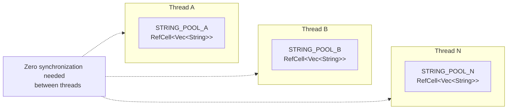

# Thread-Local Storage

### From: pool

Thread-local storage (TLS) is a programming mechanism where each thread of execution has its own independent instance of a variable, providing implicit isolation without explicit synchronization. In Rust, this is implemented through the `thread_local!` macro, which generates code using platform-specific TLS implementations underneath a convenient, type-safe API. The `pool.rs` module leverages TLS as the foundation of its pooling strategy, declaring `STRING_POOL` as a `thread_local!` static containing a `RefCell<Vec<String>>`. This design choice fundamentally shapes the module's performance characteristics and thread safety guarantees. Because each thread has its own pool, all pool operations—acquiring strings, returning strings, checking statistics—are inherently single-threaded from the pool's perspective. This eliminates lock contention entirely, a critical consideration for high-throughput message processing where lock acquisition could become a bottleneck. The trade-off is memory overhead: with N threads, there are N independent pools each capable of holding up to TEXT_POOL_SIZE strings, compared to a global pool which would need only one set of 256 strings regardless of thread count.

Accessing thread-local data in Rust requires the `with` method, which takes a closure that receives a reference to the thread-local value. This API design ensures proper initialization on first access and prevents issues with thread-local destructors. The module consistently uses `STRING_POOL.with(|pool| ...)` pattern, which has subtle but important implications. The closure cannot return references that outlive the closure invocation, which is why `PooledString::new()` must pop the string value rather than return a reference. This ownership transfer from pool to PooledString is essential for the API's ergonomics. The `RefCell` wrapping enables mutation through the immutable reference provided by `with`. An important consideration for production deployments is TLS cleanup: when threads exit, their TLS destructors run, which in this case drops the RefCell and its contents. This provides natural cleanup of pooled resources when threads terminate, preventing leaks in dynamic thread pool scenarios. However, for long-lived threads (typical in async runtimes), the `clear_pools()` function provides explicit cleanup capability.

## Diagram

## External Resources

- [Rust thread_local macro documentation](https://doc.rust-lang.org/std/thread_local/index.html) - Rust thread_local macro documentation
- [Thread-local storage - Wikipedia overview](https://en.wikipedia.org/wiki/Thread-local_storage) - Thread-local storage - Wikipedia overview
- [Rustonomicon on thread-local data implementation](https://doc.rust-lang.org/nomicon/exotic-sizes.html#thread-local-data) - Rustonomicon on thread-local data implementation

## Related

- [Object Pooling](object-pooling.md)
- [Interior Mutability](interior-mutability.md)

## Sources

- [pool](../sources/pool.md)
