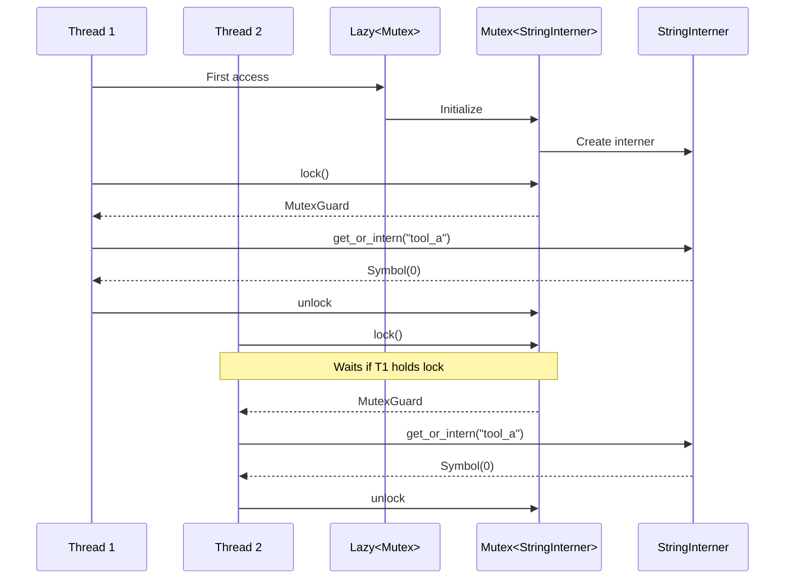

# Thread-Safe Global State

### From: intern

Managing global mutable state in concurrent programs represents one of the classic challenges in systems programming. This module demonstrates a pragmatic approach using `Lazy<Mutex<T>>` to provide thread-safe access to a shared resource without requiring complex initialization protocols. The `Lazy` wrapper ensures that initialization occurs exactly once, even when multiple threads race to first access, while the `Mutex` provides mutual exclusion for all subsequent operations.

The pattern implemented here involves specific engineering tradeoffs that reflect real-world constraints. The choice of `Mutex` over `RwLock` simplifies the implementation but serializes all interning operations, potentially creating a bottleneck under extreme concurrency. The "poisoned" panic handling via `.expect("interner poisoned")` follows Rust's standard mutex semantics, where a thread panic while holding a lock marks the mutex as poisoned to prevent access to potentially corrupted state. This defensive programming approach prioritizes crash safety over attempted recovery.

The module's documentation explicitly acknowledges the memory retention tradeoff: strings are never deallocated. This design decision eliminates the complexity of reference counting or garbage collection across thread boundaries, at the cost of potentially unbounded memory growth. For the intended use case of interning a bounded set of tool names and common identifiers, this tradeoff is entirely appropriate. The pattern shown here appears frequently in Rust systems programming, from logging frameworks to connection pools, where controlled global state provides practical simplicity without sacrificing safety.

## Diagram

## External Resources

- [Rust standard library Mutex documentation](https://doc.rust-lang.org/std/sync/struct.Mutex.html) - Rust standard library Mutex documentation
- [Blog post on mutex implementation and performance considerations](https://matklad.github.io/2020/01/02/atomic-mutex.html) - Blog post on mutex implementation and performance considerations

## Related

- [Interior Mutability](interior-mutability.md)

## Sources

- [intern](../sources/intern.md)
