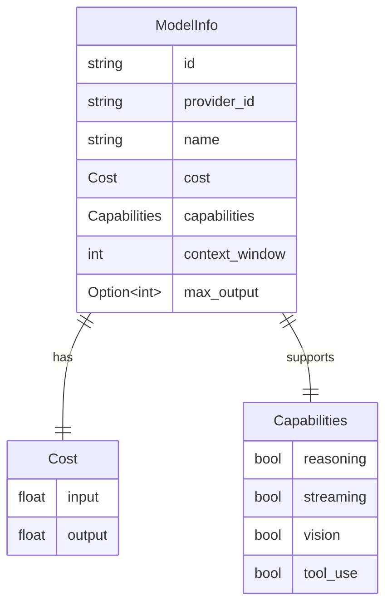

# Token Cost and Capability Modeling

### From: gemini

The cost and capability modeling system in this codebase provides a structured approach to managing the economic and functional dimensions of LLM operations. The `Cost` struct captures pricing at granular per-million-token rates for both input (prompt) and output (completion) tokens, reflecting the asymmetric pricing common in the industry where generation is often more expensive than processing. This structure enables precise cost estimation and budgeting for multi-turn conversations and batch processing workloads.

The `Capabilities` struct uses boolean flags to represent model affordances—reasoning (chain-of-thought or extended inference), streaming (incremental response generation), vision (image understanding), and tool_use (function calling). This capability-based approach allows the application to make informed routing decisions, selecting appropriate models for specific tasks. For instance, a request requiring image analysis would be routed only to models with `vision: true`, while a complex reasoning task might prefer models with `reasoning: true` despite higher costs. The context window size (1-2 million tokens for Gemini variants) and maximum output limits are similarly modeled, preventing token overflow errors through proactive validation.

The model catalog in `gemini_default_models` illustrates how these abstractions map to concrete provider offerings. Gemini 2.5 Pro Preview commands premium pricing ($1.25 input/$10.00 output per million tokens) for enhanced reasoning, while Flash variants optimize for cost efficiency at 8-12x lower rates with reduced capability sets. This structured metadata enables dynamic model selection strategies such as cost-aware routing, capability-based filtering, and intelligent fallback chains when preferred models are unavailable. The design anticipates rapid model evolution, allowing new variants to be added to the catalog without code changes to consumer logic that queries capabilities.

## Diagram

## External Resources

- [Google AI Gemini pricing details](https://ai.google.dev/pricing) - Google AI Gemini pricing details
- [OpenAI tokenization visualization (concept reference)](https://platform.openai.com/tokenizer) - OpenAI tokenization visualization (concept reference)

## Sources

- [gemini](../sources/gemini.md)
