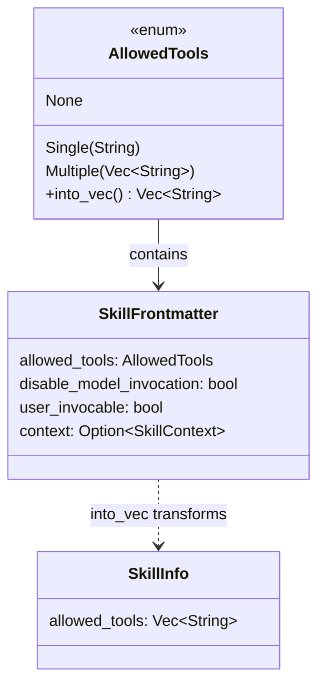

# Tool Allowlisting and Security

### From: loader

Tool allowlisting is a security mechanism that explicitly defines which tools an AI agent can access when a particular skill is active, preventing unauthorized or dangerous operations. The `allowed-tools` field in skill frontmatter supports flexible specification as either a single tool name (`allowed-tools: bash`) or a list of tools (`allowed-tools: [bash, read, write]`), implemented through Serde's untagged enum deserialization. This design choice accommodates different authoring preferences while maintaining type safety. When a skill is loaded, the `AllowedTools::into_vec()` method normalizes both forms into a consistent `Vec<String>` for runtime checking. The security model assumes a default-deny posture—unspecified tools require explicit user permission for each invocation. Additional security controls include `disable-model-invocation` to restrict skills to user-initiated calls only, and `context: fork` for creating isolated execution environments. The combination of these controls enables fine-grained capability management appropriate for different trust levels and operational contexts.

## Diagram

## External Resources

- [Principle of least privilege in security design](https://en.wikipedia.org/wiki/Principle_of_least_privilege) - Principle of least privilege in security design
- [Anthropic's tool use documentation and security considerations](https://docs.anthropic.com/en/docs/build-with-claude/tool-use) - Anthropic's tool use documentation and security considerations

## Sources

- [loader](../sources/loader.md)
