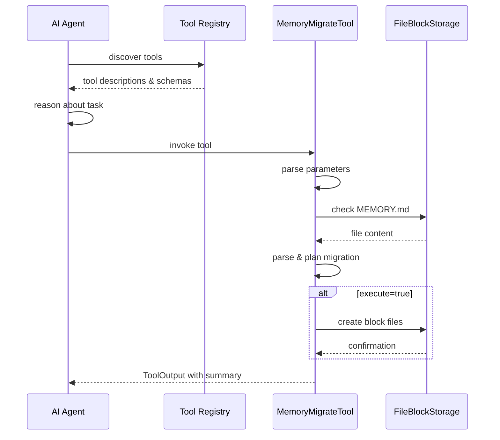

# Tool-Based Agent Architecture

### From: memory_migrate

Tool-based agent architecture represents a design paradigm for AI systems where capabilities are decomposed into discrete, composable units—tools—that agents can discover, invoke, and potentially compose to accomplish complex tasks. This architectural style contrasts with monolithic agent implementations where all capabilities are embedded in a single codebase, offering advantages in extensibility, maintainability, and security isolation that have driven adoption across major AI platforms including OpenAI's function calling, Google's tool use in Gemini, and open-source frameworks like LangChain and LlamaIndex. The ragent-core `Tool` trait and `MemoryMigrateTool` implementation exemplify this architecture's expression in Rust-based systems.

The contract defined by the `Tool` trait—encompassing name, description, parameter schema, permission category, and execution semantics—enables several architectural capabilities. Self-describing tools allow agents to perform retrieval-augmented capability discovery, where language models use tool descriptions to select appropriate actions without hard-coded routing logic. Structured parameter schemas, expressed here in JSON Schema via `serde_json`, enable automatic UI generation, validation, and type-safe deserialization that prevents common injection vulnerabilities. Permission categorization supports principle-of-least-privilege execution where sensitive operations require explicit authorization, containing potential damage from compromised or errant agents.

Tool execution contexts, represented by `ToolContext` in ragent-core, provide isolation boundaries that prevent tool implementations from directly accessing agent-internal state while supplying necessary environmental information. This pattern resembles dependency injection in traditional software engineering, where explicit context provision enables testability and controlled resource access. The async execution model supports non-blocking tool invocation that maintains agent responsiveness during I/O-intensive operations like file system access or network requests, with `ToolOutput` providing structured return channels for both success results and error information.

The migration tool specifically demonstrates how tool architecture accommodates evolving system requirements without core framework modification. Memory format migration is not a primitive agent capability but a specialized operation that can be added, updated, or removed without affecting other system components. This modularity supports continuous deployment practices where tool updates can be rolled out incrementally, with version selection and capability deprecation managed through the tool registry rather than system-wide releases. The architecture's flexibility extends to multi-agent systems where different agents might possess distinct tool subsets based on their roles, and to human-in-the-loop workflows where tool invocations can be intercepted for approval or modification.

## Diagram

## External Resources

- [OpenAI function calling documentation](https://platform.openai.com/docs/guides/function-calling) - OpenAI function calling documentation
- [Capsicum capability-based security model](https://www.cl.cam.ac.uk/research/security/capsicum/) - Capsicum capability-based security model
- [Microservices architecture by Martin Fowler](https://martinfowler.com/articles/microservices.html) - Microservices architecture by Martin Fowler

## Sources

- [memory_migrate](../sources/memory-migrate.md)

### From: structured_memory

Tool-based agent architecture represents a design pattern wherein AI systems expose capabilities through discrete, composable interfaces rather than monolithic functionality, enabling modular extension and clearer reasoning boundaries. This document exemplifies the pattern through three specialized tools—MemoryStoreTool, MemoryRecallTool, and MemoryForgetTool—that each encapsulate a single domain capability with well-defined inputs, outputs, and side effects. The architecture typically involves a Tool trait or interface that standardizes discovery, invocation, and permission management, allowing agents to dynamically select appropriate tools based on user needs or planning algorithms. The implementation here shows this through the common methods required: name for identification, description for capability documentation, parameters_schema for structured input validation, permission_category for access control, and execute for operation implementation.

The benefits of tool-based decomposition manifest across multiple dimensions of system design. For agent reasoning, explicit tool boundaries improve interpretability—language models can generate structured tool calls with named arguments rather than emitting opaque API requests, and tool results return in standardized formats that inform subsequent reasoning. For system security, permission categorization enables fine-grained access policies where different agent configurations might permit read-only tools while restricting write operations, or allow memory recall while prohibiting deletion. The "file:read" and "file:write" categories used here demonstrate semantic grouping that transcends individual tool identities, supporting policy expressions like "grant read access to all memory tools" rather than enumerating specific permissions.

Tool parameter schemas deserve particular attention as they bridge between flexible natural language interaction and rigid programmatic interfaces. The JSON Schema definitions embedded in parameters_schema methods enable validation, documentation generation, and structured parsing that reduces error rates in agent-generated invocations. Required versus optional fields, type constraints, enumerated values, and descriptive text all contribute to robust human-AI collaboration where agents understand tool capabilities precisely. The async_trait decoration indicates that tool execution may involve I/O operations, network requests, or other asynchronous work, with the ToolContext providing dependency injection for storage, event buses, and session state. This architecture scales effectively as agents accumulate dozens or hundreds of capabilities while maintaining clear contracts and testable boundaries between functional domains.
