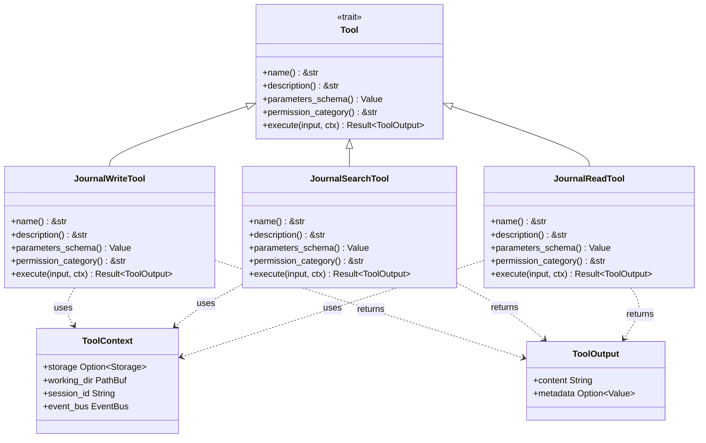

# Tool-Based Agent Interfaces

### From: journal

Tool-based agent interfaces represent an architectural pattern where AI systems interact with external capabilities through structured, discoverable tool definitions rather than direct API calls or code execution. This approach, exemplified by the Tool trait implementation in this codebase, enables safer and more controllable agent behavior by requiring explicit interface contracts with schemas, descriptions, and permission categories. The pattern has become foundational in modern agent frameworks, from OpenAI's function calling to LangChain's tools and beyond.

The Tool trait design visible in this implementation includes several critical components for robust agent integration. Each tool declares a name for invocation identification, a description for language model understanding of purpose and appropriate use, a JSON Schema defining acceptable parameters for structured validation, and a permission category for access control. The execute method receives validated input and a ToolContext providing access to shared resources like storage and event buses. This structure enables runtime discovery where agents can enumerate available capabilities and their requirements, making informed decisions about which tools to invoke for particular objectives.

The journal tools demonstrate how domain-specific capabilities integrate into this framework. JournalWriteTool carries the "file:write" permission category, acknowledging its state-mutating nature, while the read and search tools carry "file:read" permissions. Schema definitions enforce parameter structure, with required fields clearly distinguished and types constrained. Description strings are crafted for language model consumption, explaining not just what the tool does but when and why to use it, including suggestions like tag examples. This level of interface explicitness supports both human oversight and autonomous agent operation, creating clear boundaries around what agents can do and how they should request to do it.

## Diagram

## External Resources

- [OpenAI function calling documentation](https://platform.openai.com/docs/guides/function-calling) - OpenAI function calling documentation
- [JSON Schema specification for parameter validation](https://json-schema.org/) - JSON Schema specification for parameter validation
- [LangChain tools concept documentation](https://python.langchain.com/docs/concepts/tools/) - LangChain tools concept documentation

## Sources

- [journal](../sources/journal.md)
