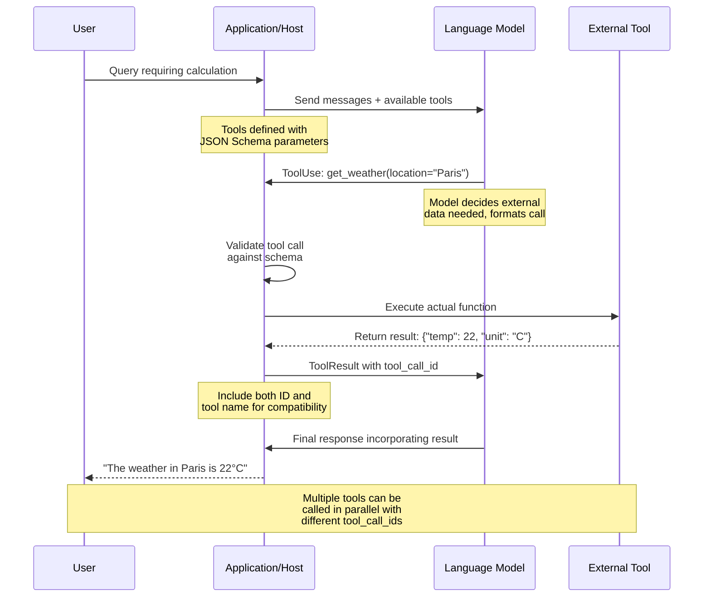

# Tool Calling in LLMs

### From: ollama

Tool calling (also referred to as function calling) in large language models represents the capability for models to identify when external computation is needed, formulate structured requests to invoke capabilities, and incorporate results back into their reasoning process. This paradigm shift transforms LLMs from pure text generators into agents that can interact with external systems—querying databases, calling APIs, performing calculations, or manipulating files. The implementation follows a structured protocol where models generate specially formatted outputs (typically JSON objects describing desired function invocations) that the hosting system parses, executes, and returns results for subsequent model consideration.

The protocol architecture for tool calling involves three distinct message roles beyond the traditional user/assistant exchange. The `assistant` role gains the ability to emit `tool_calls` containing function names and arguments, though the model does not actually execute these—the host system does. A new `tool` role carries results back to the model, with mandatory `tool_call_id` fields linking responses to specific invocations. This enables parallel tool calling where a single model response may request multiple independent function executions. The ragent-core implementation demonstrates sophisticated handling of this protocol, including bidirectional translation between the crate's `ContentPart::ToolUse` and `ContentPart::ToolResult` types and the JSON structures required by provider APIs.

Implementation challenges in tool calling center on reliability and security. Models may generate malformed JSON, hallucinate function names, or provide arguments of incorrect types—the hosting system must validate all invocations against registered schemas before execution. The `ToolDefinition` structures visible in the source code include JSON Schema for parameters, enabling runtime validation. Streaming adds complexity as tool arguments may arrive incrementally across multiple SSE events, requiring accumulation before the complete invocation is available. Security considerations are paramount since arbitrary code execution capabilities would create vulnerabilities; production implementations typically sandbox tool execution, whitelist allowed functions, or require user confirmation for sensitive operations. The ragent-core code shows thoughtful handling of tool result formatting, including both OpenAI-compatible `tool_call_id` fields and Ollama-native `tool_name` fields to maximize interoperability.

## Diagram

## External Resources

- [OpenAI function calling guide and best practices](https://platform.openai.com/docs/guides/function-calling) - OpenAI function calling guide and best practices

## Related

- [OpenAI-compatible API](openai-compatible-api.md)
- [Server-Sent Events for LLM Streaming](server-sent-events-for-llm-streaming.md)

## Sources

- [ollama](../sources/ollama.md)
