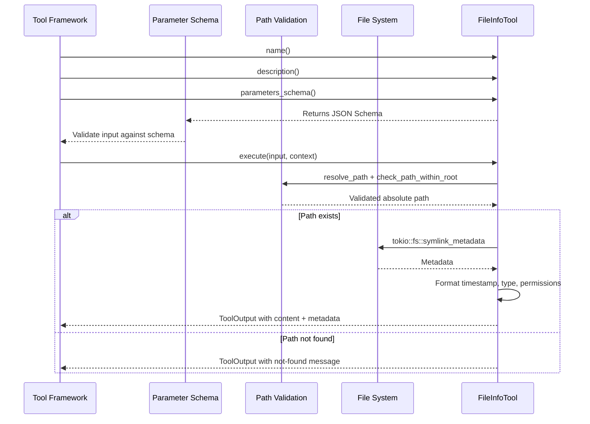

# Tool Framework Architecture

### From: file_info

The tool framework architecture embodied in this code represents a plugin-style design pattern where discrete capabilities are encapsulated as implementors of a common `Tool` trait. This architectural approach enables modularity, discoverability, and consistent interfaces across diverse functionality. Each tool declares metadata (name, description, parameter schema, permission category) that supports introspection for dynamic UI generation, API documentation, and security policy enforcement. The trait-based design allows the framework to treat heterogeneous tools uniformly while preserving type safety.

The `Tool` trait interface reveals sophisticated design considerations. The `parameters_schema` method returns a `serde_json::Value` representing a JSON Schema, enabling runtime validation of inputs against declared types and constraints. This self-documenting approach allows generic tooling to present appropriate input interfaces without tool-specific knowledge. The `permission_category` method supports capability-based security models where access decisions can be made centrally based on declared intent rather than implicit behavior. The `execute` method's signature accepting `Value` and returning `Result<ToolOutput>` provides flexibility while `ToolOutput`'s dual content/metadata structure serves both human and machine consumers.

This architecture facilitates composition and extensibility. New tools are added by implementing the trait, with the framework handling dispatch, validation, security checks, and output formatting. The `async_trait` integration allows tools to perform I/O without blocking framework operations. The pattern resembles command-pattern implementations and plugin architectures found in sophisticated automation systems, IDE extensions, and agent frameworks. The `ragent-core` crate location suggests this powers an agent-based system where tools provide capabilities that LLMs or other controllers can invoke, with the structured schemas enabling automatic tool description for AI context windows.

## Diagram

## External Resources

- [Wikipedia article on the Command design pattern](https://en.wikipedia.org/wiki/Command_pattern) - Wikipedia article on the Command design pattern
- [JSON Schema specification for validating JSON data structures](https://json-schema.org/) - JSON Schema specification for validating JSON data structures
- [Rust patterns for trait-based plugin systems](https://docs.rs/trait-bound/latest/trait_bound/) - Rust patterns for trait-based plugin systems

## Sources

- [file_info](../sources/file-info.md)

### From: team_message

Tool framework architectures provide structured mechanisms for extending software systems with pluggable capabilities that can be discovered, inspected, and invoked at runtime. The `TeamMessageTool` implementation demonstrates this pattern through its `Tool` trait implementation, where each tool defines a contract comprising metadata (name, description), schema (parameters), permissions (category), and behavior (execution). This architectural approach enables systems to present uniform interfaces over diverse capabilities, supporting both human developers and automated agents in understanding and utilizing available functionality.

The trait-based design in Rust leverages the language's zero-cost abstraction capabilities, where dynamic dispatch is avoided through monomorphization or, in this case, likely object-safe trait objects for runtime polymorphism. The `async_trait` macro bridges the gap between Rust's native async/await syntax and trait object safety requirements, allowing async execution within trait methods. The schema returned by `parameters_schema` follows JSON Schema conventions, enabling automatic validation, IDE support, and UI generation from tool definitions—critical for systems where tools may be invoked by both humans and other software components.

Permission categorization through `permission_category` represents a capability-based access control approach, where permissions are associated with functional domains rather than coarse-grained roles. The "team:communicate" category suggests a hierarchical permission namespace where "team" is a domain and "communicate" a specific action within that domain. This granularity supports principle of least privilege and enables fine-grained audit logging, though it requires careful design to avoid permission explosion. The pattern shown here anticipates systems where tool access is granted dynamically based on agent roles, current task context, or explicit authorization workflows.

Execution contexts, represented by `ToolContext`, provide tools with access to ambient capabilities and state without requiring explicit parameter passing for cross-cutting concerns. The `team_context` field within this context demonstrates dependency injection of agent identity, allowing the tool to determine message sender without requiring the caller to specify it. This design prevents spoofing attacks where malicious callers might forge sender identities, while also simplifying tool usage by removing redundant parameters. The `working_dir` field similarly provides filesystem context, enabling tools to locate team configurations relative to a workspace root rather than requiring absolute paths.
