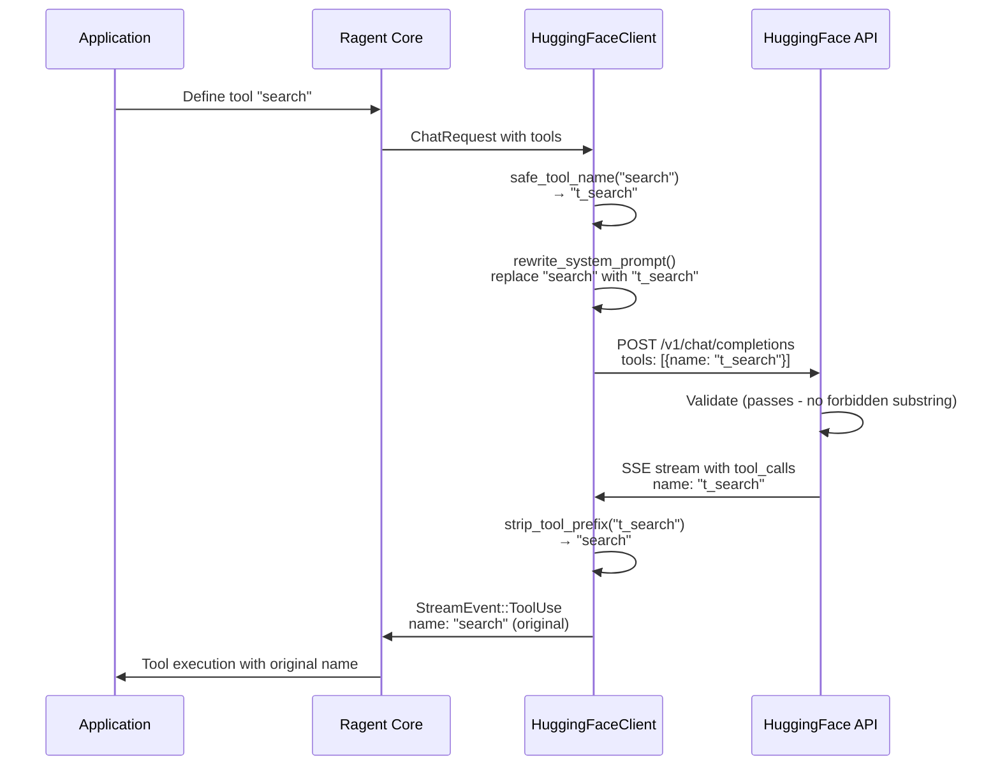

# Tool Name Prefixing for API Compatibility

### From: huggingface

Tool name prefixing represents a pragmatic solution to API constraints that demonstrates how client implementations must sometimes work around provider-specific limitations while maintaining interface compatibility. The HuggingFace Inference API's router implements a security filter that rejects tool names containing common action substrings—specifically including "read", "write", "search", "list", "open", "memo", "pdf", and "todo"—when operating in streaming mode. This restriction, likely implemented to prevent prompt injection or unauthorized actions through tool names, creates a significant challenge for LLM client libraries that need to support arbitrary tool names defined by application developers.

The solution implemented in HuggingFaceClient involves systematic transformation of tool identifiers at multiple points in the request-response cycle. First, all tool names are prefixed with "t_" using the safe_tool_name() function, transforming names like "search" into "t_search" and "write_file" into "t_write_file". Second, the system prompt must be rewritten via rewrite_system_prompt() to use these prefixed names, ensuring the model receives consistent information about available tools. The implementation sorts tool names by descending length before replacement to prevent partial match issues—without this ordering, replacing "write" before "write_file" would incorrectly transform the latter into "t_write_file" then "t_t_write_file". Finally, when processing model responses, strip_tool_prefix() removes the prefix to recover original names for ragent's internal processing.

This concept illustrates broader patterns in API integration engineering: the tension between provider constraints and user expectations, the need for bidirectional data transformation, and the importance of maintaining abstraction boundaries. The prefixing is completely transparent to ragent's higher layers—the ToolDefinition structs and chat completion interfaces remain unchanged—while solving a specific infrastructure limitation. The implementation also demonstrates defensive programming: the strip_tool_prefix function gracefully handles already-stripped names by returning the original if no prefix is found, preventing double-prefixing in edge cases. Similar patterns appear throughout production AI engineering, such as OpenAI's function calling name restrictions or Anthropic's beta flag requirements, where client libraries must paper over provider inconsistencies.

## Diagram

## External Resources

- [HuggingFace API security considerations and restrictions](https://huggingface.co/docs/api-inference/security) - HuggingFace API security considerations and restrictions

## Sources

- [huggingface](../sources/huggingface.md)
