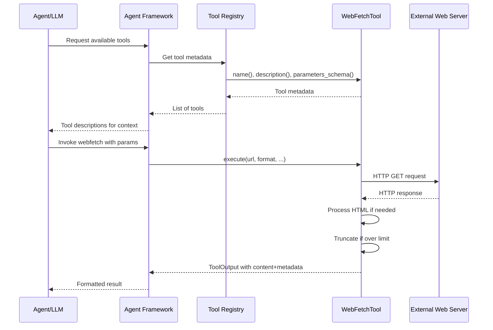

# Tool Pattern in Agent Architectures

### From: webfetch

The Tool pattern is a fundamental architectural concept in AI agent systems that abstracts capabilities into modular, discoverable, and invokable components. Unlike monolithic agents with built-in functionality, tool-based architectures separate capability implementation from agent reasoning, enabling dynamic extension and safer execution isolation. Each tool exposes metadata (name, description, parameter schema) that allows agents to understand when and how to invoke the capability, typically through structured outputs like JSON function calls.

The pattern implemented in ragent follows established conventions from systems like OpenAI's function calling, LangChain tools, and the Model Context Protocol. The `Tool` trait defines the contract: tools must identify themselves, describe their purpose in natural language, declare their parameter structure via JSON Schema, specify a permission category for security policy, and implement execution logic. This contract enables automated integration—agent frameworks can enumerate available tools, present descriptions to language models, validate model-generated parameters against schemas, execute with parsed arguments, and return results for agent incorporation. The asynchronous execution model (`async fn execute`) supports concurrent tool use without blocking agent reasoning.

WebFetchTool exemplifies a "retrieval tool" category common in agent systems: capabilities that fetch external information to ground agent responses in current or specialized knowledge. Other common categories include computation tools (calculators, code interpreters), action tools (API calls, database operations), and utility tools (file system access, search). The permission category mechanism suggests potential for capability-based security where agent deployments can restrict tool availability based on trust boundaries. This architecture scales from simple single-tool agents to complex multi-agent systems where tools may be remote services or other agents themselves.

## Diagram

## External Resources

- [OpenAI function calling documentation](https://platform.openai.com/docs/guides/function-calling) - OpenAI function calling documentation
- [LangChain tools concept documentation](https://python.langchain.com/docs/concepts/tools/) - LangChain tools concept documentation
- [Anthropic's tool use announcement and patterns](https://www.anthropic.com/news/tool-use-ga) - Anthropic's tool use announcement and patterns

## Sources

- [webfetch](../sources/webfetch.md)

### From: aiwiki_search

The Tool pattern is a fundamental abstraction in AI agent systems that enables language models to interact with external capabilities through structured interfaces. In this implementation, the pattern manifests as a `Tool` trait defining a contract with methods for identification (`name`), capability description (`description`), parameter specification (`parameters_schema`), access control (`permission_category`), and execution (`execute`). This design decouples agent reasoning from capability implementation, allowing the same agent core to work with diverse tools from web search to database queries to code execution.

The pattern's power lies in its alignment with how large language models handle function calling. The `parameters_schema` method returns JSON Schema, which matches the OpenAPI function calling specifications used by GPT-4, Claude, and other modern LLMs. This enables automatic tool discovery where an agent can present available tools to a model, which then generates structured JSON arguments matching the schema. The `execute` method receives these validated arguments and returns standardized `ToolOutput`, creating a clean separation between model-facing interface and implementation detail. This is crucial for security and reliability, as raw model outputs never directly touch implementation code.

The async design of the `execute` method reflects the reality that most useful tools involve I/O—network requests, database queries, file operations, or subprocess execution. The `ToolContext` parameter provides ambient capabilities like working directory access without cluttering every tool's parameter schema with infrastructure concerns. The permission categorization enables least-privilege security models where agents can be restricted to tool categories appropriate to their deployment context. This pattern has become standard across agent frameworks including LangChain, OpenAI's function calling, and autonomous agent projects like AutoGPT, representing convergent evolution toward safe, composable AI systems.
