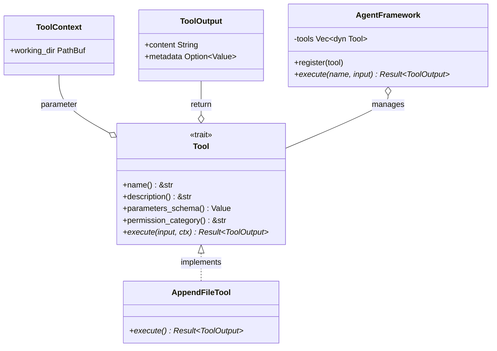

# Tool Trait Architecture for AI Agents

### From: append_file

The Tool trait architecture represents a design pattern for building extensible, composable capabilities in AI agent systems. The `AppendFileTool` implements this trait, conforming to a standardized interface that allows the agent framework to discover, validate, and execute tools uniformly without hardcoding tool-specific logic. This pattern mirrors plugin architectures in traditional software and function-calling interfaces in modern large language model APIs, providing a clean separation between agent orchestration and capability implementation.

The trait interface captured in this implementation includes five core methods: `name()` provides a stable identifier for tool invocation, `description()` supplies natural language documentation for agent planning, `parameters_schema()` returns the JSON Schema for validation, `permission_category()` enables security policy enforcement, and `execute()` performs the actual operation. This design supports introspection—agents can query available tools and their schemas to construct appropriate execution plans. The `async_trait` attribute enables async execution, critical for I/O-bound tools without blocking the agent event loop.

The architecture enables powerful composition patterns. Tools can be filtered by permission category for sandboxed execution, wrapped with telemetry or caching middleware, or dynamically loaded from external crates. The `ToolContext` parameter provides contextual information (working directory in this case) without requiring tools to maintain state, supporting functional programming principles. The `ToolOutput` return type standardizes success responses with optional structured metadata, enabling downstream processing of tool results. For multi-agent systems, this architecture supports tool sharing, delegation, and capability advertisement across agent boundaries.

## Diagram

## External Resources

- [Rust Traits chapter in The Book](https://doc.rust-lang.org/book/ch10-02-traits.html) - Rust Traits chapter in The Book
- [OpenAI Function Calling API documentation](https://platform.openai.com/docs/guides/function-calling) - OpenAI Function Calling API documentation
- [async-trait crate for async methods in traits](https://docs.rs/async-trait/latest/async_trait/) - async-trait crate for async methods in traits

## Sources

- [append_file](../sources/append-file.md)
