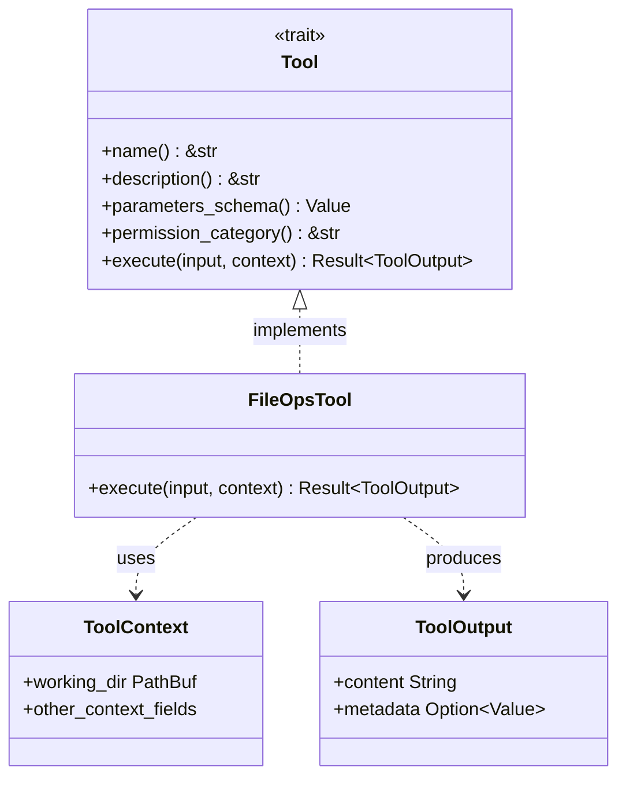

# Tool Trait Architecture

### From: file_ops_tool

The Tool trait architecture represents a plugin-based design pattern for extensible agent systems, where capabilities are encapsulated as discrete, discoverable units that share a common interface. This architecture enables dynamic composition of agent behaviors without hard-coding specific implementations, supporting scenarios where tools may be loaded from external crates, configured at runtime, or even generated automatically. The `FileOpsTool` demonstrates this pattern by implementing a `Tool` trait that standardizes naming, description, schema validation, permission categorization, and execution semantics.

The trait contract visible in the implementation includes five core methods: `name()` for identification, `description()` for documentation, `parameters_schema()` for input validation, `permission_category()` for security policy, and `execute()` for the actual operation. This separation of concerns allows agent frameworks to implement cross-cutting concerns generically—input validation against JSON Schema, permission checking before execution, and standardized output formatting—without duplicating logic in each tool. The use of `async-trait` indicates the architecture supports asynchronous operations, essential for I/O-bound tools.

The permission category system (`file:write` in this case) suggests integration with capability-based security models, where agents request and are granted specific permissions rather than inheriting broad system access. This is critical for running untrusted or partially-trusted code generation in sandboxed environments. The architecture likely supports tool introspection for automatic UI generation, where LLMs or human interfaces can discover available capabilities and construct valid invocations based on schemas. This pattern appears in systems like OpenAI's Function Calling, LangChain's Tools, and similar agent frameworks where composability and safety are paramount.

## Diagram

## External Resources

- [Rust trait objects for dynamic dispatch](https://doc.rust-lang.org/book/ch17-02-trait-objects.html) - Rust trait objects for dynamic dispatch
- [OpenAI function calling - similar tool architecture pattern](https://platform.openai.com/docs/guides/function-calling) - OpenAI function calling - similar tool architecture pattern
- [Capability-based security model](https://en.wikipedia.org/wiki/Capability-based_security) - Capability-based security model

## Related

- [JSON schema validation](json-schema-validation.md)

## Sources

- [file_ops_tool](../sources/file-ops-tool.md)

### From: memory_search

The Tool trait in this codebase defines a standard interface for capabilities that AI agents can invoke, establishing patterns essential for maintainable agent systems. MemorySearchTool implements this trait, conforming to contracts including name() for tool identification, description() for LLM tool selection, parameters_schema() for JSON Schema validation, permission_category() for authorization, and execute() for actual implementation. This trait-based design enables polymorphic tool collections where the agent framework can discover, present, and invoke tools without knowing their specific functionality.

The architectural decisions embedded in this trait reflect hard-won experience with LLM-agent integration. The parameters_schema returning serde_json::Value enables runtime schema generation—tools can construct schemas dynamically based on configuration rather than compile-time constants. This supports conditional parameter sets, like MemorySearchTool's min_similarity that only applies to semantic mode. The permission_category enables coarse-grained security policies; an administrator might grant "file:read" tools to certain agents while restricting "file:write". The async execute with anyhow::Result error handling accommodates both IO-bound operations (database queries, API calls) and complex error propagation up to agent-level recovery.

The trait's design anticipates evolution in both tool implementations and agent capabilities. New tools can be added without modifying the framework; experimental tools can implement reduced interfaces behind feature flags. The ToolOutput type with content and metadata separation supports flexible result presentation—raw text for LLM consumption, structured metadata for application integration. Event emission through ToolContext.event_bus provides cross-cutting observability without polluting tool implementations with instrumentation code. These patterns collectively enable the plugin-like extensibility where MemorySearchTool and similar capabilities can be developed, tested, and deployed independently while integrating seamlessly into agent execution loops.
