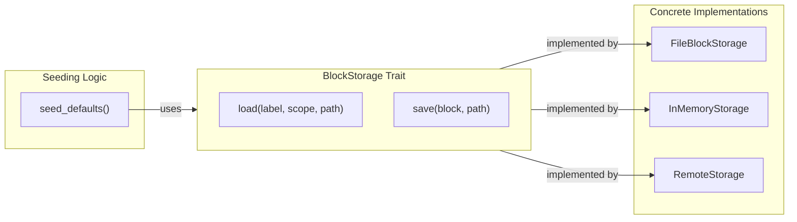

# Trait-Based Storage Abstraction

### From: defaults

Trait-based storage abstraction in Rust enables the `defaults` module to remain agnostic to underlying persistence mechanisms while defining clear contracts for memory block operations. The `BlockStorage` trait—referenced through the `&dyn BlockStorage` parameter type—establishes an interface boundary separating seeding logic from storage implementation details. This architectural pattern allows the same initialization code to operate against file systems, databases, remote APIs, or in-memory test doubles without modification, promoting code reuse and testability across diverse deployment scenarios.

The dynamic dispatch through trait objects (`&dyn`) rather than static generics reflects practical engineering considerations. While generics enable monomorphization and potential optimization, they propagate type parameters through calling code, complicating API boundaries. For initialization operations that execute infrequently and involve I/O-bound storage operations, the marginal runtime cost of dynamic dispatch is negligible compared to the architectural flexibility gained. The trait likely defines essential operations: `load` retrieving optional blocks by label and scope, `save` persisting blocks to storage, and potentially deletion or listing operations for complete memory management.

This abstraction proves particularly valuable in testing, as evidenced by the test module's use of `FileBlockStorage`. The tests exercise real storage operations against temporary directories, providing confidence in integration behavior, but the trait interface enables alternative approaches. Tests could substitute mock implementations capturing call patterns, error injection for resilience validation, or in-memory stores for faster execution. The `seed_defaults` function's ignorance of concrete storage types—whether filesystem paths, database connection pools, or network clients—exemplifies the dependency inversion principle: high-level initialization policy depends on abstract storage capability rather than concrete implementation, while low-level storage details depend on the trait contract.

## Diagram

## External Resources

- [Rust documentation on trait objects and dynamic dispatch](https://doc.rust-lang.org/book/ch17-02-trait-objects.html) - Rust documentation on trait objects and dynamic dispatch
- [Dependency inversion principle from SOLID design principles](https://en.wikipedia.org/wiki/Dependency_inversion_principle) - Dependency inversion principle from SOLID design principles

## Related

- [Idempotent Initialization](idempotent-initialization.md)

## Sources

- [defaults](../sources/defaults.md)

### From: cross_project

Trait-based storage abstraction is a Rust-specific implementation of the strategy pattern, using the language's trait system to define interfaces that multiple storage backends can implement. In the cross-project module, this appears as the `BlockStorage` trait passed as `&dyn BlockStorage` to all major functions. This design decouples the cross-project resolution logic from any specific persistence mechanism, allowing the same code to operate against file systems, databases, network services, or mock implementations for testing. The trait object (`dyn`) enables dynamic dispatch, trading slight runtime overhead for flexibility in backend selection without generic parameter proliferation.

This abstraction is crucial for the module's testability and extensibility. The comprehensive test suite uses `FileBlockStorage` as a concrete implementation, but the trait boundary means tests could easily substitute in-memory implementations for speed or mock implementations for deterministic behavior. In production deployments, organizations might implement `BlockStorage` for shared network storage, encrypted local storage, or version-controlled storage with git-backed persistence. The trait's method signatures—taking `&BlockScope` and `&PathBuf` rather than raw paths—encode domain semantics at the type level, preventing common errors like confusing global and project scope paths. This pattern exemplifies how Rust's ownership and trait systems encourage API designs that are both flexible and misuse-resistant.
