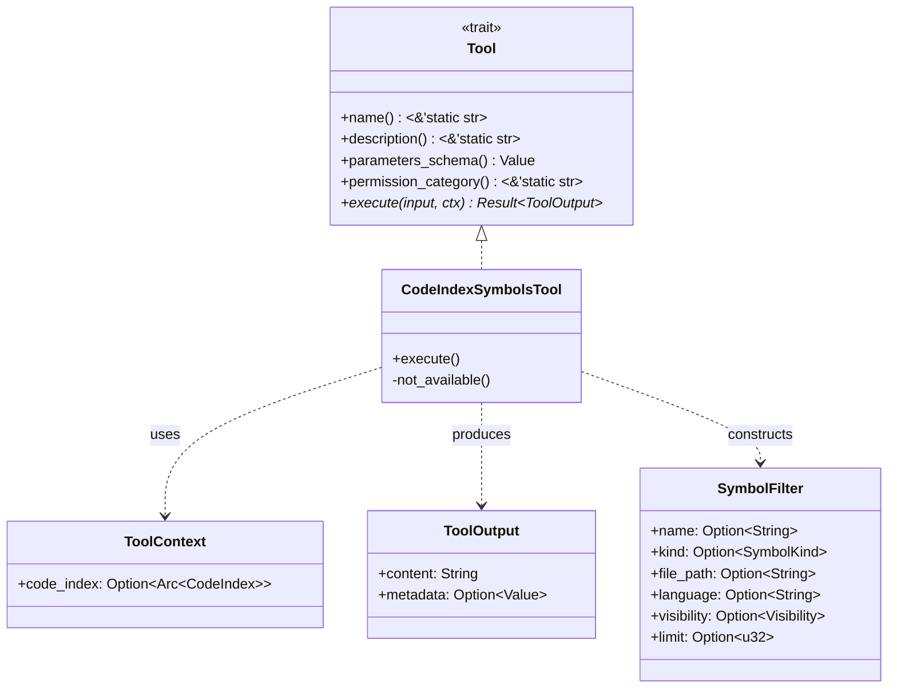

# Trait-Based Tool Architecture

### From: codeindex_symbols

Trait-based tool architecture is a design pattern in Rust that enables polymorphic behavior through interface definitions rather than inheritance hierarchies. In ragent-core, the `Tool` trait serves as the fundamental abstraction for all capabilities that AI agents can invoke, establishing a contract that every tool must fulfill. This pattern leverages Rust's trait system to achieve zero-cost abstractions while maintaining compile-time safety guarantees. The trait definition visible through `CodeIndexSymbolsTool`'s implementation includes methods for identity (`name`), description (`description`), interface specification (`parameters_schema`), security classification (`permission_category`), and execution logic (`execute`). This comprehensive interface ensures that tools are self-describing and can participate in automated discovery and orchestration systems.

The architectural benefits of this approach are evident in how it supports modular system evolution. New tools can be added to the system without modifying existing code, simply by implementing the `Tool` trait and registering the implementation. The use of `async_trait` to enable asynchronous execution within the trait system addresses Rust's current limitations with async functions in traits, providing ergonomic syntax while the compiler generates the necessary state machine transformations. The `ToolContext` parameter to `execute` represents a form of dependency injection, giving tools access to shared resources like the code index without hardcoding their construction. This separation of resource provision from tool logic enhances testability, as mock contexts can be provided during unit testing.

This architecture pattern aligns with broader trends in AI system design, where tool use frameworks like LangChain, Semantic Kernel, and OpenAI's function calling API similarly define structured interfaces for capabilities that language models can invoke. The JSON schema returned by `parameters_schema` enables runtime validation of tool inputs and can be used to generate user interfaces or prompt engineering for language models. The permission category system suggests integration with authorization frameworks, allowing fine-grained control over which tools can access sensitive resources. By standardizing on a trait-based approach, ragent-core positions itself to integrate with diverse tool implementations while maintaining consistent operational semantics across the system.

## Diagram

## External Resources

- [The Rust Programming Language - Traits: Defining Shared Behavior](https://doc.rust-lang.org/book/ch10-02-traits.html) - The Rust Programming Language - Traits: Defining Shared Behavior
- [async-trait crate for async functions in traits](https://docs.rs/async-trait/latest/async_trait/) - async-trait crate for async functions in traits
- [OpenAI Function Calling - similar patterns in AI tool frameworks](https://platform.openai.com/docs/guides/function-calling) - OpenAI Function Calling - similar patterns in AI tool frameworks

## Sources

- [codeindex_symbols](../sources/codeindex-symbols.md)
