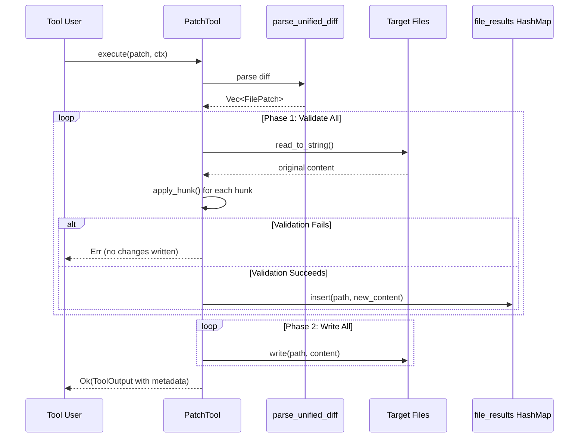

# Transactional Patch Application

### From: patch

Transactional patch application is a safety pattern that ensures atomicity in multi-file modification operations, guaranteeing that either all changes apply successfully or none are persisted, thereby preventing partial-application states that could corrupt a codebase or leave it in an inconsistent condition. The ragent-core implementation achieves this through a classic two-phase approach: Phase 1 reads all target files, parses all hunks, validates that every hunk can be matched to its expected location in the original content, and computes the complete modified content for each file without writing anything to disk. Only after this validation succeeds does Phase 2 perform the actual file writes, by which point the operation cannot fail meaningfully except for catastrophic system errors like disk full or power loss.

This pattern addresses failure modes that have historically plagued patch utilities, where a hunk might apply successfully to the first few files in a multi-file patch but fail on a later file, leaving the system in a partially-modified state that can be difficult to diagnose and recover from. The consequences range from broken builds (if header files are modified but implementation files are not) to security vulnerabilities (if security patches are only partially applied). The implementation uses Rust's Result type and early return via the ? operator to ensure that any validation failure immediately aborts the entire operation before the write phase begins. The HashMap-based accumulation of file_results provides temporary storage for computed modifications, with the write loop consuming this map only after complete validation.

The transactional approach interacts carefully with the asynchronous I/O model, using tokio::fs operations that could theoretically fail independently across files. However, because all content is computed before any writes begin, and because the write operations are independent (each file modification is idempotent with respect to the others), the failure of one write after others succeed would still leave the system in a valid state from the perspective of each individual file—though this scenario would represent a bug in the implementation's atomicity guarantees. In practice, modern filesystems and the sequential write loop make this failure mode extremely unlikely. The pattern exemplifies defensive programming in agentic systems, where autonomous modification of code requires higher safety standards than interactive tools because there's no human in the loop to notice and correct partial failures.

## Diagram

## External Resources

- [Rust Result type documentation for error handling](https://doc.rust-lang.org/std/result/) - Rust Result type documentation for error handling

## Sources

- [patch](../sources/patch.md)
