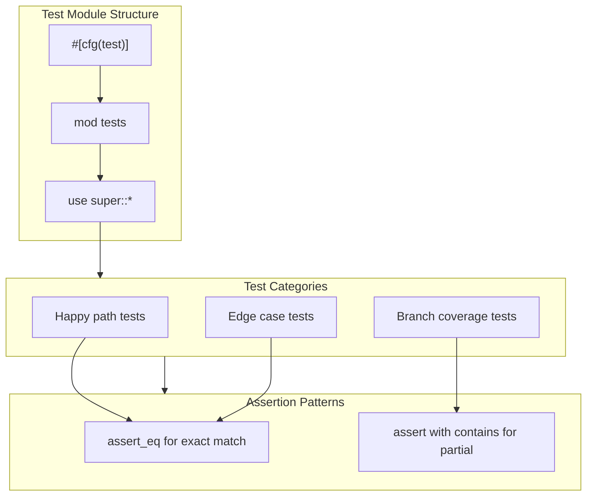

# Unit Testing Patterns

### From: format

The `format.rs` module demonstrates comprehensive unit testing through its private `tests` submodule containing nine test functions that exercise all public API surface. Each test follows a consistent pattern: invoking the function under test with representative inputs and asserting expected output via `assert_eq` or `assert` macros. The tests serve dual purposes as documentation—showing expected behavior through concrete examples—and as regression prevention, validating that refactoring preserves semantics.

Edge case coverage distinguishes the test suite's quality. `test_format_summary_content` validates both content-present and empty-content paths. `test_format_status_output` exercises stdout-only, stderr-only, and timeout-flag scenarios. The pluralization tests explicitly include zero cases, which are common bug sources where developers forget that zero grammatically pluralizes in English. `test_format_edit_summary` covers all four branches of the conditional matrix, while `test_format_display_path` tests relative-path-under-working-dir, absolute-outside-working-dir, and already-relative paths.

The testing approach uses inline test data rather than fixtures or external files, appropriate for pure functions with simple inputs. Standard library `Path` construction via `Path::new` enables path testing without file system dependencies, keeping tests fast and deterministic. The `#[cfg(test)]` conditional compilation ensures test code doesn't inflate release binaries. This pattern exemplifies Rust's built-in testing culture where tests reside alongside implementation, maintaining locality and encouraging maintenance. The module's near 1:1 ratio of test functions to public functions suggests testing is integral to the development workflow rather than an afterthought.

## Diagram

## External Resources

- [Rust book chapter on writing tests](https://doc.rust-lang.org/book/ch11-01-writing-tests.html) - Rust book chapter on writing tests
- [Rust by Example: unit testing patterns](https://doc.rust-lang.org/rust-by-example/testing/unit_testing.html) - Rust by Example: unit testing patterns

## Related

- [Content Format Patterns](content-format-patterns.md)
- [Pluralization Logic](pluralization-logic.md)

## Sources

- [format](../sources/format.md)
