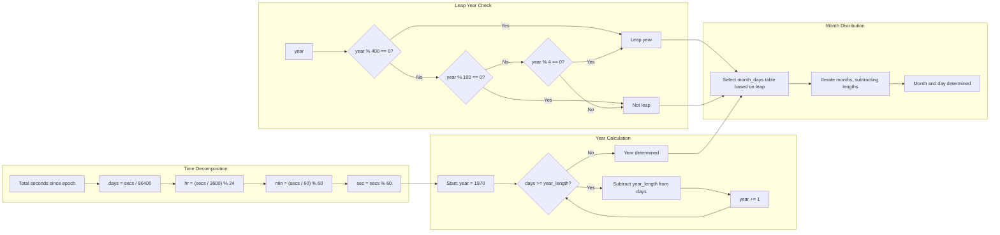

# Unix Timestamp Conversion

### From: file_info

Unix timestamp conversion is the process of transforming a count of seconds since the Unix epoch (January 1, 1970, 00:00:00 UTC) into human-readable calendar date and time representations. This codebase implements a complete manual conversion algorithm, deliberately avoiding external date libraries to minimize dependencies. The implementation handles the full complexity of the Gregorian calendar including leap year calculations, month length variations, and the 400-year leap year cycle exception rule.

The conversion process in this code follows a multi-step algorithm. First, the total seconds are decomposed into days, hours, minutes, and remaining seconds through integer division. The `days_to_ymd` function then iteratively subtracts complete years, accounting for leap years through the `is_leap` helper function that implements the standard rule: years divisible by 4 are leap years, except those divisible by 100 unless also divisible by 400. After determining the year, the function distributes remaining days across months using a table of month lengths that conditionally sets February to 29 days in leap years.

This manual implementation represents a significant engineering trade-off. While crates like `chrono` provide comprehensive date-time functionality with timezone support and arithmetic operations, they add substantial compile-time and binary size overhead. For a tool requiring only UTC timestamp formatting without complex date manipulation, the custom implementation provides adequate functionality with minimal footprint. The code demonstrates that for constrained domains, handwritten algorithms can replace general-purpose libraries. However, this approach requires careful validation—the implementation must correctly handle edge cases like the year 2000 (a leap year despite being divisible by 100) and the transition across month boundaries. The use of unsigned 64-bit integers provides range for timestamps spanning millions of years, far exceeding practical requirements.

## Diagram

## External Resources

- [Wikipedia article on Unix time, covering epoch definition and timestamp representation](https://en.wikipedia.org/wiki/Unix_time) - Wikipedia article on Unix time, covering epoch definition and timestamp representation
- [POSIX standard definition of seconds since the epoch](https://pubs.opengroup.org/onlinepubs/9699919799/basedefs/V1_chap04.html#tag_04_15) - POSIX standard definition of seconds since the epoch
- [Date library by Howard Hinnant, influential in C++ and related timestamp handling approaches](https://howardhinnant.github.io/date/date.html) - Date library by Howard Hinnant, influential in C++ and related timestamp handling approaches

## Sources

- [file_info](../sources/file-info.md)
