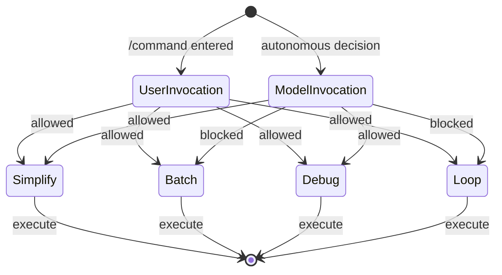

# User vs Model Invocation Control

### From: bundled

Invocation control is a safety and governance mechanism that distinguishes between human-initiated and AI-autonomous skill execution, implemented in ragent through the `user_invocable` and `disable_model_invocation` boolean fields in SkillInfo. This binary permission model creates clear operational boundaries: some skills like `simplify` and `debug` can be triggered by either users or the AI model itself, while `batch` and `loop` are restricted to user initiation only. This distinction reflects careful risk assessment of different automation capabilities and their potential consequences.

The design rationale becomes apparent when examining restricted skills. The `batch` skill orchestrates large-scale parallel changes across codebases—operations that could modify hundreds of files based on pattern matching. Autonomous execution risks include unintended matches, cascading errors, and difficult reversions. Requiring explicit human initiation ensures intentionality and provides an opportunity for scope confirmation. The `loop` skill implements scheduled repeated execution, which presents resource consumption risks, infinite loop scenarios if termination conditions fail, and potential for automated actions to compound while unattended. User initiation provides accountability and enables manual cancellation through conventional mechanisms.

Conversely, skills permitting model invocation support autonomous workflows where the AI proactively applies its capabilities. The `simplify` skill's code review can be triggered when the model detects relevant contexts, such as after git operations or during idle periods. The `debug` skill can be autonomously invoked when error patterns are detected in session logs. This flexibility enables sophisticated agent behaviors while maintaining safety boundaries. The permission model is enforced at multiple layers: SkillInfo declaration for intent, runtime checks for authorization, and test validation ensuring documented behavior. The `test_batch_skill` and `test_loop_skill` assertions explicitly verify `disable_model_invocation` is true, preventing accidental relaxation of these constraints. This multi-layered approach exemplifies defense-in-depth security architecture applied to AI agent governance.

## Diagram

## External Resources

- [Human-in-the-loop - paradigm for maintaining human oversight in automated systems](https://en.wikipedia.org/wiki/Human-in-the-loop) - Human-in-the-loop - paradigm for maintaining human oversight in automated systems
- [Anthropic AI safety research - relevant to invocation control design](https://www.anthropic.com/safety) - Anthropic AI safety research - relevant to invocation control design

## Sources

- [bundled](../sources/bundled.md)
