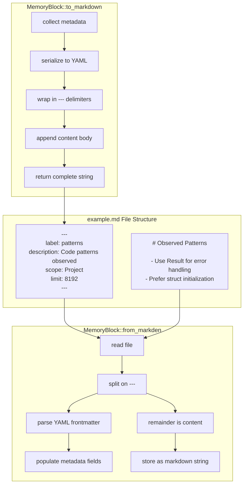

# YAML Frontmatter

### From: storage

YAML frontmatter is the metadata format used by ragent memory blocks to store structured information before the main Markdown content. This format, popularized by static site generators like Jekyll and now widely used in documentation tools, places YAML key-value pairs between triple-dash delimiters at the start of a Markdown file. For ragent memory blocks, this frontmatter contains the block's label, description, scope, timestamps, content limits, and other metadata, while the remainder of the file after the closing delimiter contains the actual block content in Markdown format.

The choice of YAML frontmatter provides several advantages for this use case. First, it maintains human readability and editability—users can open .md files in any text editor and both understand and modify the metadata. This is crucial for a developer tool where users may want to version control and manually edit memory blocks. Second, the format is widely supported by Markdown parsers and tooling, ensuring compatibility with existing workflows. Third, the clear separation between metadata and content allows the system to parse and validate metadata independently while treating the content as opaque Markdown text.

The implementation details are handled by the MemoryBlock's `from_markdown` and `to_markdown` methods (called from the storage layer), which serialize and deserialize the structured block data. The storage layer itself treats the Markdown representation as opaque strings, delegating parsing to the domain model. This separation of concerns keeps the storage implementation focused on file I/O while the block module handles format specifics. When saving, the atomic write mechanism ensures the entire frontmatter-plus-content structure is written consistently. The format enables rich metadata without sacrificing the simplicity and portability of plain text files, aligning with Unix philosophy and developer tooling conventions.

## Diagram

## External Resources

- [Jekyll frontmatter documentation - popularized the format](https://jekyllrb.com/docs/front-matter/) - Jekyll frontmatter documentation - popularized the format
- [YAML specification for frontmatter syntax](https://yaml.org/spec/) - YAML specification for frontmatter syntax
- [Pandoc's YAML metadata block extension](https://pandoc.org/MANUAL.html#extension-yaml_metadata_block) - Pandoc's YAML metadata block extension

## Sources

- [storage](../sources/storage.md)
