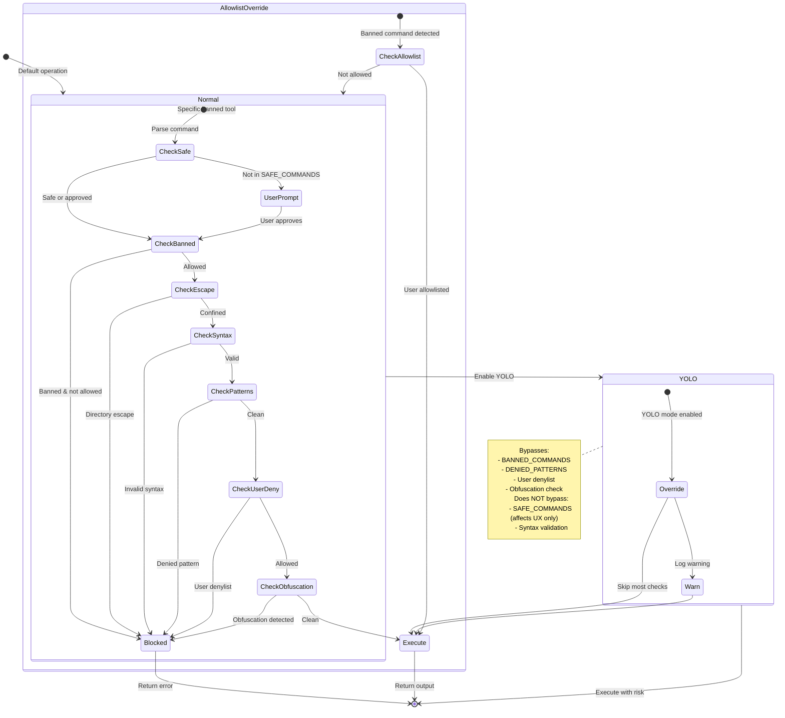

# YOLO Mode and Configurable Security Policy

### From: bash

YOLO mode represents an explicit escape hatch in BashTool's security architecture, acknowledging that rigid security controls can impede legitimate development workflows and that operator override capability is essential for practical deployment. The name—an acronym for "You Only Live Once"—signals that this is an intentional risk acceptance mechanism, not a bypass vulnerability. Implemented through `crate::yolo::is_enabled()`, this mode allows commands to proceed despite matching banned command lists, denied patterns, user denylist entries, or obfuscation detection. The implementation includes explicit warning logs when YOLO mode activates, creating audit trails for security review. This design pattern exemplifies the security engineering principle that perfect prevention is impossible and detectable, auditable override mechanisms are preferable to hidden bypasses or frustrated users disabling security entirely.

The configurable security policy extends beyond YOLO mode to user-managed allowlists and denylists through `crate::bash_lists`. The `is_allowlisted` function permits administrators to explicitly approve specific banned commands for particular workflows—for example, allowing `curl` for a specific API integration while keeping the general ban. The `matches_denylist` function enables custom policy enforcement beyond the built-in DENIED_PATTERNS, allowing organizations to block organization-specific sensitive paths or prohibited operations. Both mechanisms integrate with the layered security model: user allowlist entries exempt commands from banned tool detection, while user denylist entries add additional restrictions atop the built-in protections. The error messages guide users toward self-service policy management, suggesting commands like `/bash remove deny "{pattern}"` for policy modification.

This configurable architecture reflects mature security design that balances default safety with operational flexibility. The built-in protections represent secure defaults appropriate for most deployments—blocking obviously dangerous operations while permitting common development workflows. The YOLO mode provides emergency override for unusual situations, with logging for accountability. The user-managed lists enable customization without code changes, supporting organizational policy compliance and workflow-specific needs. Together, these mechanisms implement a "defense in depth with escape hatches" model where multiple independent controls must fail or be intentionally disabled for compromise to occur. The explicit nature of these controls—clearly named functions, warning logs, helpful error messages—supports both security auditing and user education, making the security model transparent rather than opaque.

## Diagram

## External Resources

- [NIST Cybersecurity Framework on risk management](https://www.nist.gov/cyberframework) - NIST Cybersecurity Framework on risk management
- [CISA Zero Trust Maturity Model](https://www.cisa.gov/zero-trust-maturity-model) - CISA Zero Trust Maturity Model

## Sources

- [bash](../sources/bash.md)
