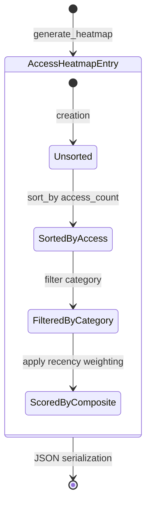

# AccessHeatmapEntry

**Type:** technology

### From: visualisation

AccessHeatmapEntry captures multi-dimensional access pattern data for individual memories, enabling heatmap visualisation that surfaces frequently and recently accessed knowledge. The struct combines identity information (row ID and category), content preview for contextual recognition, quantitative access metrics (count and timestamp), and quality metadata (confidence score) into a unified record optimized for ranking and display. This design supports a usage-based information retrieval paradigm where the system proactively surfaces relevant memories based on interaction history rather than relying solely on explicit search queries.

The access_count field provides absolute usage frequency, while last_accessed offers temporal recency in ISO 8601 format—together enabling composite ranking algorithms that balance popularity (how often) and freshness (how recent). The Option wrapper on last_accessed accommodates memories that may exist without access tracking initialization, gracefully handling migration scenarios or newly created entries. The confidence field's inclusion suggests the heatmap may serve dual purposes: as a usage dashboard and as a quality assurance tool highlighting high-confidence memories that warrant attention or low-confidence memories needing verification.

Content preview generation mirrors TimelineEntry's truncation logic, maintaining visual consistency across different visualisation types within the same interface. The category field preservation enables filtering or grouping within the heatmap display, supporting drill-down from aggregate heatmaps to category-specific views. The struct's field selection reflects careful curation for a specific user experience: enough information to identify and evaluate a memory without requiring full content retrieval, appropriate for dense list or grid layouts where multiple entries occupy screen space simultaneously. The sorting implementation in generate_heatmap uses access_count descending exclusively, suggesting the current interface prioritizes popularity over recency, though the last_accessed data availability enables alternative sort orders or composite scoring in future iterations.

## Diagram

## External Resources

- [Heat map visualisation and data density representation](https://en.wikipedia.org/wiki/Heat_map) - Heat map visualisation and data density representation

## Sources

- [visualisation](../sources/visualisation.md)
