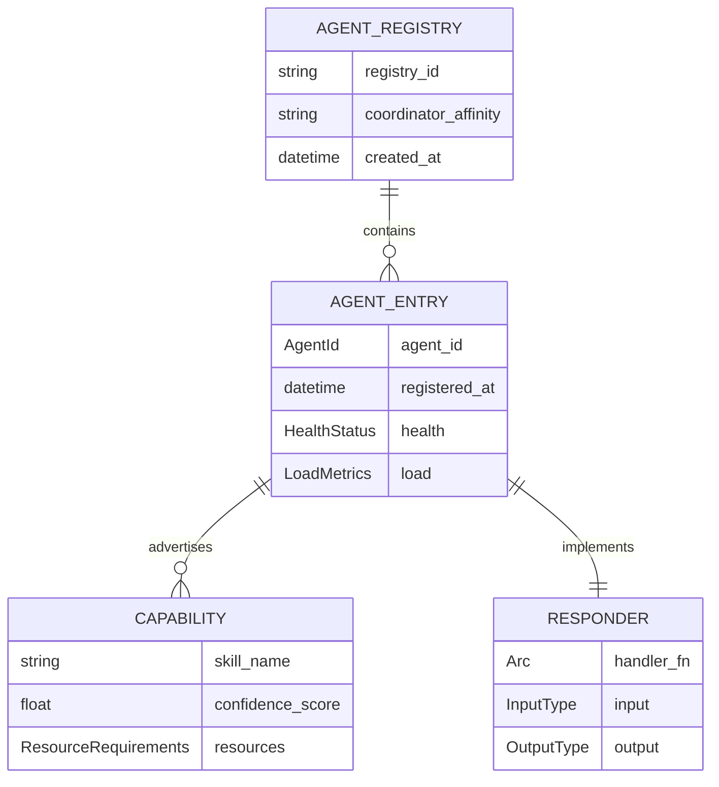

# AgentRegistry

**Type:** technology

### From: mod

The AgentRegistry serves as the authoritative directory service for agent instances within the ragent-core orchestration ecosystem, implementing a capability-based discovery pattern essential for flexible multi-agent coordination. As a core component exposed through the public `registry` module, it maintains mappings between agent identifiers (AgentId), their advertised capabilities, and their responder implementations that define agent behavior. The registry's design enables dynamic registration patterns where agents can join the system at runtime, advertise multiple capabilities (such as "search", "analysis", or "compile"), and provide optional responder closures that process incoming job payloads. This architecture supports hot-swapping and graceful degradation scenarios, allowing the orchestrator to route around failed agents by consulting the registry for alternatives with matching capabilities.

The AgentRegistry implements the Responder type as an Arc-wrapped async closure, enabling shared ownership across threads while maintaining zero-cost abstractions. In the documented test cases, we observe agents registered with capability vectors like `vec!["search".to_string(), "analysis".to_string()]`, demonstrating the multi-dimensional skill advertisement pattern. The registry's query semantics allow the Coordinator to resolve capability requirements to concrete agent instances, with the negotiation layer potentially selecting among multiple qualified candidates based on load balancing, affinity, or other policy considerations. The registry also integrates with the transport layer abstractions, positioning itself as the anchor point for distributed scenarios where agents may reside on remote nodes. Its async registration methods (`register().await`) indicate readiness for network-backed implementations where agent enrollment involves distributed consensus or authentication protocols.

The registry abstraction represents a critical separation of concerns in the overall architecture, decoupling agent discovery from execution coordination. By externalizing capability matching from the Coordinator, the system enables pluggable discovery strategies—ranging from simple in-memory hash maps (current MVP implementation) to distributed service meshes or consensus-based registries in future milestones. The AgentEntry type, referenced in the public exports, likely encapsulates additional metadata such as agent health, load metrics, and versioning information that sophisticated orchestration policies can leverage for intelligent routing decisions. This extensible registry design anticipates production requirements around agent lifecycle management, including graceful shutdown sequences, health check integration, and dynamic capability revocation.

## Diagram

## External Resources

- [Service discovery patterns informing AgentRegistry's capability-based design](https://en.wikipedia.org/wiki/Service_discovery) - Service discovery patterns informing AgentRegistry's capability-based design
- [Rust Arc (Atomically Reference Counted) documentation for shared ownership patterns](https://docs.rs/arc/latest/std/sync/struct.Arc.html) - Rust Arc (Atomically Reference Counted) documentation for shared ownership patterns
- [Microservices service registry pattern comparison for distributed agent systems](https://microservices.io/patterns/service-registry.html) - Microservices service registry pattern comparison for distributed agent systems

## Sources

- [mod](../sources/mod.md)

### From: router

The `AgentRegistry` represents the source of truth for agent lifecycle management within the `ragent-core` system, serving as the router's dependency for agent discovery and mailbox resolution. While the `router.rs` module only shows the consumption side of this registry through the `get` method, its role is critical: it maintains the mapping from string agent identifiers to `AgentEntry` structures containing operational metadata including the optional mailbox channel. The async nature of `registry.get(agent_id).await` suggests the registry may support distributed or persistent backing stores, not merely in-memory hash maps.

The registry abstraction enables dynamic agent topologies where agents can register and deregister at runtime, supporting elastic scaling and fault recovery scenarios. The router's defensive handling of `None` responses from `get` with the `ok_or_else` combinator demonstrates expected failure modes in production systems: agents may be referenced before registration completes, after crash recovery, or due to configuration drift between orchestrator and registry views. The error message formatting with `anyhow::anyhow!("agent '{agent_id}' not found")` provides actionable diagnostics including the specific identifier that failed resolution.

The separation between `AgentRegistry` (lookup) and `InProcessRouter` (delivery) follows the single responsibility principle, allowing independent evolution of discovery mechanisms and transport implementations. This architecture could support multiple registry backends—in-memory for testing, distributed consensus for production, or cached read replicas for high-throughput scenarios—without router modifications. The registry's return of an entry with optional mailbox also accommodates agent states where an entry exists but the agent hasn't yet initialized its communication channel.
