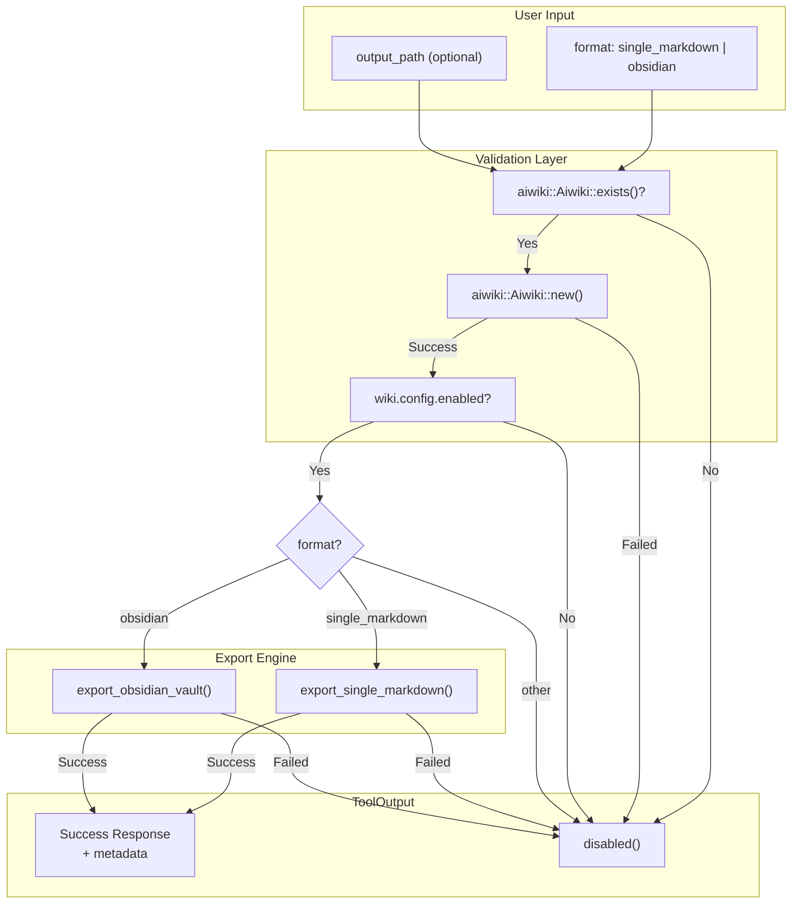

# AiwikiExportTool

**Type:** product

### From: aiwiki_export

AiwikiExportTool is a specialized software component within the ragent-core framework that enables intelligent agents to export AIWiki knowledge bases to portable formats. The tool is implemented as a zero-sized struct in Rust, following the type state pattern common in systems programming where the struct itself carries no data but provides behavior through trait implementations. This design choice minimizes memory overhead while maximizing flexibility for the tool registry system.

The tool supports two primary export modes: single markdown file generation for simple backups and documentation sharing, and Obsidian vault creation for users who prefer graph-based knowledge management. The Obsidian export is particularly significant as it preserves wiki relationships through the Obsidian graph view and backlink functionality, enabling users to visualize connections between concepts that were captured during agent interactions. The implementation includes intelligent path handling, defaulting to the working directory with descriptive filenames when users don't specify explicit output locations.

AiwikiExportTool operates within a permission-aware security model, requiring the `aiwiki:read` permission category. This ensures that agents can only export content when explicitly authorized, preventing unauthorized data extraction. The tool also implements a state machine for wiki availability, checking initialization status and enabled configuration before proceeding with export operations. This defensive programming approach prevents errors and provides clear, actionable feedback to users when prerequisites aren't met.

## Diagram

## External Resources

- [Obsidian - A powerful knowledge base that works on local Markdown files](https://obsidian.md/) - Obsidian - A powerful knowledge base that works on local Markdown files
- [anyhow crate - Flexible error handling in Rust](https://crates.io/crates/anyhow) - anyhow crate - Flexible error handling in Rust
- [async-trait crate - Async trait support for Rust](https://crates.io/crates/async-trait) - async-trait crate - Async trait support for Rust

## Sources

- [aiwiki_export](../sources/aiwiki-export.md)
