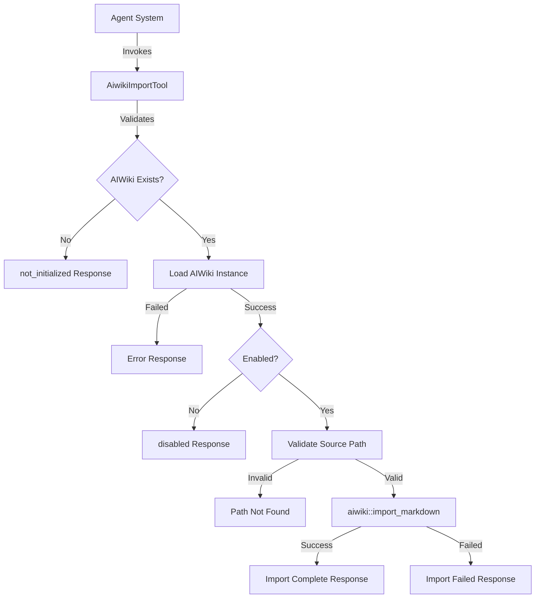

# AiwikiImportTool

**Type:** technology

### From: aiwiki_import

The AiwikiImportTool is a concrete implementation of the Tool trait in Rust, designed specifically for importing markdown content into AIWiki knowledge bases. This struct serves as the primary interface between agent systems and external knowledge sources, encapsulating the logic required to validate, transform, and integrate markdown files into the AIWiki ecosystem. The tool is designed with zero-cost abstractions in mind—the struct itself is a unit struct containing no fields, with all behavior implemented through trait methods that leverage external context and configuration.

The tool's architecture reflects modern Rust design patterns for agent systems, emphasizing type safety, explicit error handling, and async execution. When instantiated, the tool provides a complete import pipeline that handles everything from path resolution and existence validation to recursive directory traversal and Obsidian vault detection. The implementation delegates actual file operations to the underlying `ragent-aiwiki` crate, maintaining separation of concerns between the tool interface and the core knowledge management engine.

The significance of AiwikiImportTool lies in its role as a content ingestion gateway for AI agents. In knowledge-intensive workflows, agents frequently need to incorporate external documentation, research notes, or existing knowledge bases into their working context. This tool provides a standardized, secure mechanism for such imports, with built-in safeguards including permission checks, initialization validation, and configuration-aware operation. The tool's design enables batch operations while providing detailed feedback about import results, making it suitable for both interactive agent sessions and automated knowledge base maintenance workflows.

## Diagram

## External Resources

- [async-trait crate documentation for trait async method implementation](https://docs.rs/async-trait/latest/async_trait/) - async-trait crate documentation for trait async method implementation
- [Serde serialization framework for Rust](https://serde.rs/) - Serde serialization framework for Rust

## Sources

- [aiwiki_import](../sources/aiwiki-import.md)
