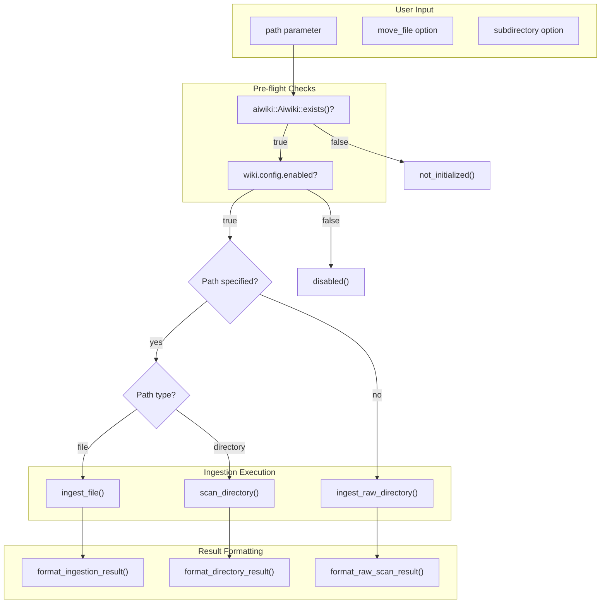

# AiwikiIngestTool

**Type:** product

### From: aiwiki_ingest

The `AiwikiIngestTool` is a specialized tool implementation designed to facilitate document ingestion into the AIWiki knowledge base system. As a concrete implementation of the `Tool` trait, it serves as the primary interface through which AI agents can add content to a project's wiki, supporting a variety of document formats and ingestion strategies. The tool is engineered with flexibility in mind, allowing users to ingest single files, recursively scan directories, or automatically detect new and modified files in a designated `raw/` folder.

The tool's architecture reflects careful consideration of user experience and system reliability. It implements comprehensive pre-flight checks to ensure the AIWiki system is properly initialized and enabled before attempting any operations, providing clear, actionable error messages when prerequisites are not met. The tool supports advanced options such as file movement (rather than copying) and subdirectory organization, enabling sophisticated content management workflows. Upon successful ingestion, it returns detailed metadata including file hashes, extracted text status, and storage paths, which support downstream synchronization and deduplication processes.

Integration with the broader `ragent-aiwiki` crate allows the tool to leverage specialized document processing capabilities including format detection, text extraction from binary formats like PDF and Word documents, and cryptographic hashing for integrity verification. The tool's design emphasizes idempotency and safety, ensuring that repeated ingestion operations do not create duplicate content and that file system operations are performed atomically where possible. This makes it suitable for both interactive use by developers and automated execution within CI/CD pipelines or agent workflows.

## Diagram

## External Resources

- [Serde serialization framework documentation for JSON handling](https://serde.rs/) - Serde serialization framework documentation for JSON handling
- [Anyhow error handling library for Rust](https://docs.rs/anyhow/latest/anyhow/) - Anyhow error handling library for Rust
- [Rust standard library Path documentation](https://doc.rust-lang.org/std/path/struct.Path.html) - Rust standard library Path documentation

## Sources

- [aiwiki_ingest](../sources/aiwiki-ingest.md)
