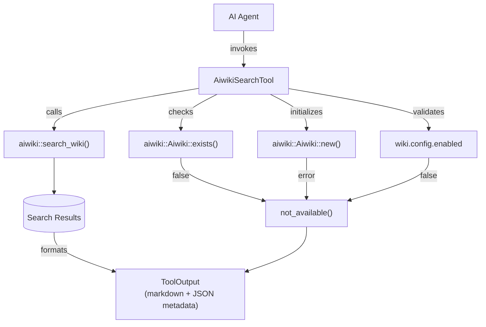

# AiwikiSearchTool

**Type:** technology

### From: aiwiki_search

AiwikiSearchTool is a Rust struct that implements search functionality for the AIWiki knowledge base within an agent framework. The tool serves as a bridge between AI agents and structured knowledge repositories, allowing agents to query ingested documents and retrieve relevant information with contextual excerpts. Its design follows the Tool trait pattern, enabling seamless integration with broader agent orchestration systems that can discover and invoke capabilities dynamically.

The tool's architecture reflects several important design principles from modern AI system development. It implements graceful degradation through its `not_available()` helper function, which returns informative error messages when the AIWiki system is uninitialized or disabled rather than crashing or returning opaque failures. This pattern is essential in production agent systems where components may have complex dependency chains. The parameter schema uses JSON Schema to define constraints including enumerated page types and bounded numeric ranges, enabling automatic validation and integration with OpenAPI-compatible function calling interfaces used by large language models.

Historically, tools like AiwikiSearchTool represent an evolution in how AI systems access information. Rather than relying solely on model weights for knowledge, they provide structured access to external, updatable knowledge bases. This approach, sometimes called retrieval-augmented generation (RAG) at the tool level, allows agents to access domain-specific or private information without retraining. The specific categorization of page types—entities, concepts, sources, and analyses—suggests an ontology inspired by semantic web and knowledge graph traditions, organizing information by its epistemological role rather than simple document structure.

## Diagram

## External Resources

- [anyhow crate - idiomatic error handling in Rust](https://docs.rs/anyhow/latest/anyhow/) - anyhow crate - idiomatic error handling in Rust
- [serde_json crate - JSON serialization in Rust](https://docs.rs/serde_json/latest/serde_json/) - serde_json crate - JSON serialization in Rust
- [async-trait crate for async trait methods in Rust](https://crates.io/crates/async-trait) - async-trait crate for async trait methods in Rust

## Sources

- [aiwiki_search](../sources/aiwiki-search.md)
