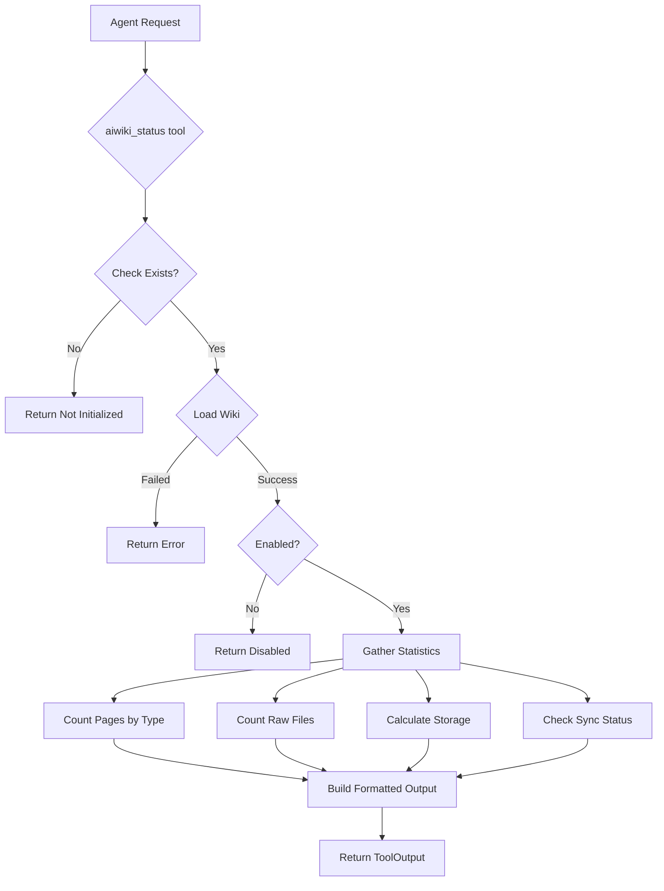

# AiwikiStatusTool

**Type:** technology

### From: aiwiki_status

The AiwikiStatusTool is a Rust struct that implements the Tool trait, serving as the primary interface for agents to query the status and statistics of an AIWiki knowledge base. This tool is designed with a zero-parameter interface, making it accessible through simple invocation without requiring complex input arguments. The implementation demonstrates sophisticated asynchronous programming patterns in Rust, utilizing recursive directory traversal to gather comprehensive statistics about the knowledge base structure.

The tool's architecture follows a layered response pattern: first checking if the AIWiki exists at all, then verifying if it's enabled, and finally proceeding to detailed statistics collection. This progressive disclosure ensures appropriate feedback for different system states. The output formatting combines Markdown for human readability with structured JSON metadata for programmatic access, supporting both agent display and downstream processing needs. The tool integrates with the broader AIWiki ecosystem through calls to library functions like `aiwiki::needs_sync()` and `aiwiki::preview_sync()`, demonstrating tight coupling between the tool layer and core knowledge base functionality.

Historically, this tool represents an evolution in knowledge management interfaces where introspection capabilities are treated as first-class features. Rather than treating the knowledge base as a black box, the AiwikiStatusTool exposes internal metrics that help agents and users understand content distribution, storage costs, and synchronization health. The implementation of helper functions like `format_bytes()` shows attention to user experience details, ensuring that technical metrics are presented in accessible forms.

## Diagram

## External Resources

- [Tokio asynchronous filesystem operations documentation](https://docs.rs/tokio/latest/tokio/fs/) - Tokio asynchronous filesystem operations documentation
- [Serde serialization framework for Rust](https://serde.rs/) - Serde serialization framework for Rust

## Sources

- [aiwiki_status](../sources/aiwiki-status.md)
