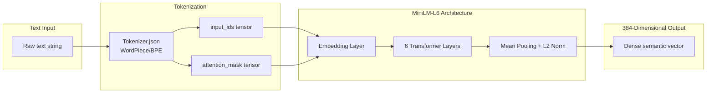

# all-MiniLM-L6-v2

**Type:** technology

### From: local

The all-MiniLM-L6-v2 is a compact sentence transformer model developed by Microsoft Research and the sentence-transformers project, designed specifically for generating semantic embeddings from text. This model belongs to the MiniLM family, which achieves competitive performance on semantic similarity tasks while being significantly smaller and faster than full-scale transformer models like BERT. With only 6 transformer layers (hence "L6") and approximately 22 million parameters, it produces 384-dimensional dense vector representations that capture semantic meaning efficiently. The model was trained using knowledge distillation from larger teacher models, enabling it to retain substantial semantic understanding capabilities while reducing computational requirements by roughly 7x compared to BERT-base.

The model's architecture is based on the MiniLM (Mini Language Model) design principles published in 2020, which introduced deep self-attention distillation to compress transformer models effectively. Unlike standard BERT models that use 12 or 24 layers, MiniLM-L6 uses just 6 layers with carefully distilled attention patterns and value relationships from larger models. This makes it particularly well-suited for on-device and edge deployment scenarios where memory and latency constraints are critical. The model has been evaluated on over 14 semantic textual similarity benchmarks and consistently ranks among the top-performing small-scale embedding models, often outperforming models with 2-3x more parameters.

In the context of ragent-core, all-MiniLM-L6-v2 serves as the default embedding backbone for local semantic search and memory retrieval. The 384-dimensional output vectors provide a good balance between representational capacity and storage efficiency—each embedding requires only 1.5KB of memory (384 × 4 bytes for f32), enabling millions of documents to be stored in reasonable RAM footprints. The model's permissive Apache 2.0 license and availability through HuggingFace's model hub make it an accessible choice for open-source projects requiring production-quality embeddings without API dependencies or usage costs.

## Diagram

## External Resources

- [Official HuggingFace model repository with documentation and usage examples](https://huggingface.co/sentence-transformers/all-MiniLM-L6-v2) - Official HuggingFace model repository with documentation and usage examples
- [MiniLM research paper: 'MiniLM: Deep Self-Attention Distillation for Task-Agnostic Compression of Pre-Trained Transformers'](https://arxiv.org/abs/2002.10957) - MiniLM research paper: 'MiniLM: Deep Self-Attention Distillation for Task-Agnostic Compression of Pre-Trained Transformers'
- [Sentence-Transformers documentation on pretrained models and performance benchmarks](https://www.sbert.net/docs/pretrained_models.html) - Sentence-Transformers documentation on pretrained models and performance benchmarks

## Sources

- [local](../sources/local.md)
