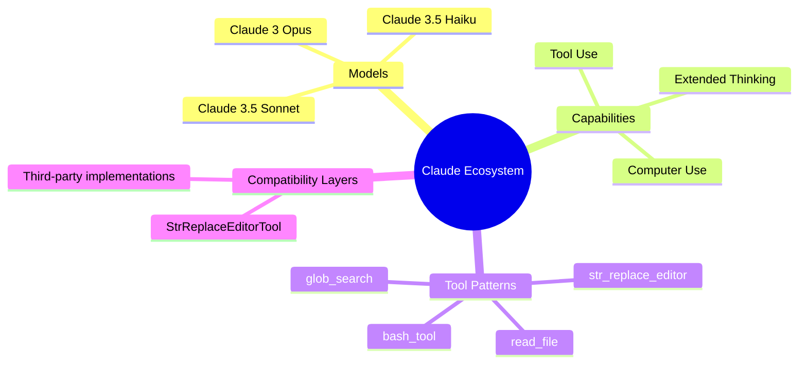

# Anthropic Claude

**Type:** product

### From: str_replace_editor

Anthropic Claude is a family of large language models developed by Anthropic, an AI safety company founded in 2021 by former OpenAI researchers including Dario and Daniela Amodei. Claude was designed with a strong emphasis on safety, helpfulness, and honesty, featuring distinctive characteristics including an exceptionally large context window (up to 200,000 tokens in Claude 3), strong performance on coding tasks, and a tool use system that enables the model to invoke external functions. The `str_replace_editor` tool analyzed in this document directly implements the interface that Claude models expect, making it a compatibility layer for systems that want to support Claude-trained behaviors.

Claude's tool use system represents a significant evolution in how language models interact with external systems. Unlike simpler function calling APIs, Claude's tool system is designed with specific patterns that models learn during training. The `str_replace_based_edit_tool` that this Rust implementation emulates exemplifies these patterns: it uses exact string matching rather than line numbers for replacements (reducing error from line count drift), requires explicit confirmation of the text being replaced (preventing unintended modifications), and provides multiple granular commands rather than a single "edit" operation. These design choices reflect Anthropic's research into making AI systems more controllable and predictable.

The existence of StrReplaceEditorTool as a compatibility layer highlights Claude's influence on the AI tooling ecosystem. When models are trained on extensive tool use demonstrations, they develop strong expectations about tool names, parameter schemas, and behavior patterns. This creates both opportunities—models that "just work" with familiar interfaces—and challenges—systems must implement these exact interfaces to achieve good performance. The detailed parameter descriptions and explicit warnings in the tool's schema suggest that Anthropic's training process produces models with specific behavioral tendencies that downstream implementers must accommodate, such as occasional omission of the `old_str` parameter that the code explicitly guards against.

## Diagram

## External Resources

- [Anthropic's official website](https://www.anthropic.com/) - Anthropic's official website
- [Claude 3.5 announcement with computer use capabilities](https://www.anthropic.com/news/3-5-models-and-computer-use) - Claude 3.5 announcement with computer use capabilities
- [Anthropic's official cookbook with tool use examples](https://github.com/anthropics/anthropic-cookbook) - Anthropic's official cookbook with tool use examples

## Sources

- [str_replace_editor](../sources/str-replace-editor.md)
