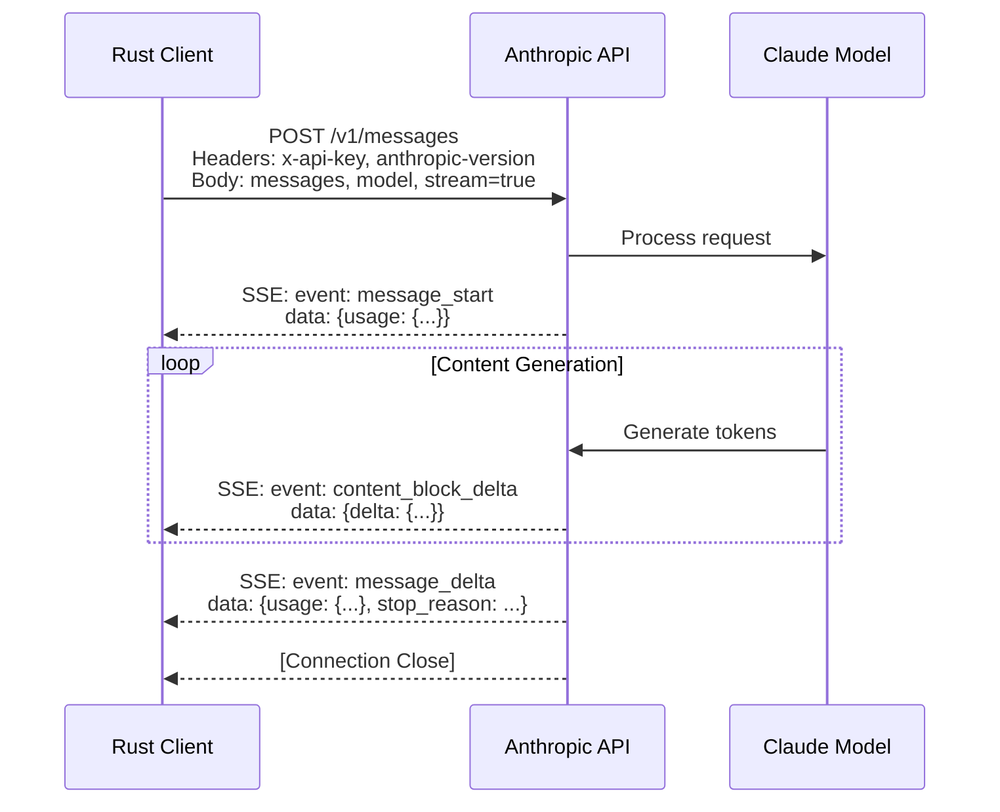

# Anthropic Messages API

**Type:** technology

### From: anthropic

The Anthropic Messages API is Anthropic's primary interface for programmatic interaction with Claude models, replacing their earlier Completions API and designed around a conversational message-based format. The API, implemented in this Rust code through the `/v1/messages` endpoint, represents a modern RESTful design that supports streaming responses via Server-Sent Events (SSE), sophisticated content types including text, images, and tool use, and extensive metadata for usage tracking and rate limiting. The API uses JSON for request and response bodies with a hierarchical structure that separates message content into distinct blocks for different modalities and purposes. Authentication is handled via `x-api-key` headers, and versioning through the `anthropic-version` header ensures backward compatibility as the API evolves.

A distinctive feature of the Messages API is its event-driven streaming protocol, which sends different event types for different stages of response generation. As implemented in this code, these events include `message_start` for initial metadata and usage statistics, `content_block_start` and `content_block_delta` for incremental content delivery, `content_block_stop` for block completion, and `message_delta` for final usage updates and stop reasons. This granular event structure enables sophisticated client applications that can display reasoning steps separately from final answers, stream tool call arguments as they're generated, and provide real-time progress indicators. The API supports multiple content block types including `text`, `thinking`, `tool_use`, and `tool_result`, allowing for rich multi-turn conversations with external tool integration.

The API's design reflects lessons learned from earlier LLM APIs, with careful attention to developer ergonomics and production concerns. Rate limiting information is provided through custom headers (`anthropic-ratelimit-requests-limit`, `anthropic-ratelimit-tokens-remaining`, etc.) that enable clients to implement intelligent retry and backoff strategies. The extended thinking feature, controlled via the `thinking` parameter with `budget_tokens`, allows fine-grained control over reasoning depth. Image inputs are handled through base64 encoding with automatic MIME type detection, supporting standard web formats. Tool definitions use JSON Schema for parameter validation, and the streaming JSON parsing for tool arguments allows applications to validate and act on partial inputs. The API's consistent error handling with HTTP status codes and JSON error bodies, combined with detailed logging hooks as seen in this implementation, supports robust production deployments.

## Diagram

## External Resources

- [Official Anthropic Messages API documentation](https://docs.anthropic.com/en/api/messages) - Official Anthropic Messages API documentation
- [Streaming and SSE event documentation](https://docs.anthropic.com/en/api/messages-streaming) - Streaming and SSE event documentation
- [Extended thinking and reasoning capabilities](https://docs.anthropic.com/en/docs/build-with-claude/extended-thinking) - Extended thinking and reasoning capabilities

## Sources

- [anthropic](../sources/anthropic.md)
