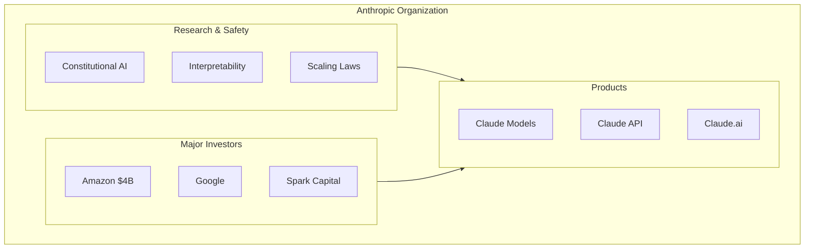

# Anthropic

**Type:** organization

### From: anthropic

Anthropic is an AI safety company founded in 2021 by former OpenAI researchers including siblings Dario and Daniela Amodei. The company has emerged as one of the leading developers of large language models, with its Claude family of models being particularly notable for their strong performance on reasoning tasks, extensive context windows, and emphasis on helpfulness, harmlessness, and honesty. Anthropic has pioneered several important technical innovations in the LLM space, including Constitutional AI for alignment, and has been at the forefront of developing models with extended thinking capabilities that can show their reasoning process. The company has raised significant funding including a $4 billion investment from Amazon and maintains both API and consumer-facing products. Their approach to AI development emphasizes safety research and they have published extensively on interpretability, scaling laws, and the societal implications of advanced AI systems.

The organization has released multiple generations of Claude models, with each iteration bringing substantial improvements in capabilities. Claude 3 introduced the family structure with Opus, Sonnet, and Haiku variants optimized for different use cases, while later versions have focused on reasoning capabilities and tool use. Claude Sonnet 4, referenced in this implementation, represents their latest advancement in balanced performance and capability. Anthropic's API design reflects their focus on developer experience, with features like streaming responses, built-in vision capabilities, and native support for extended thinking modes that allow developers to control and observe model reasoning. The company's rate limiting approach uses custom headers to provide detailed information about request and token quotas, enabling sophisticated client-side traffic management.

Anthropic has positioned itself as a leader in responsible AI development, with significant investments in red-teaming, safety evaluations, and the development of techniques like RLHF (Reinforcement Learning from Human Feedback) and Constitutional AI. Their models are known for strong performance on benchmarks while maintaining relatively conservative approaches to potentially harmful outputs. The Claude API's design, as implemented in this Rust code, demonstrates their commitment to providing rich metadata and control to developers, including detailed usage statistics, configurable reasoning budgets, and streaming responses that enable real-time applications. The company's technical decisions, such as using SSE for streaming and providing granular event types, reflect modern best practices for LLM API design.

## Diagram

## External Resources

- [Anthropic official website and company information](https://www.anthropic.com/) - Anthropic official website and company information
- [Anthropic API documentation and developer guides](https://docs.anthropic.com/) - Anthropic API documentation and developer guides
- [Anthropic research publications and safety work](https://www.anthropic.com/research) - Anthropic research publications and safety work

## Sources

- [anthropic](../sources/anthropic.md)
