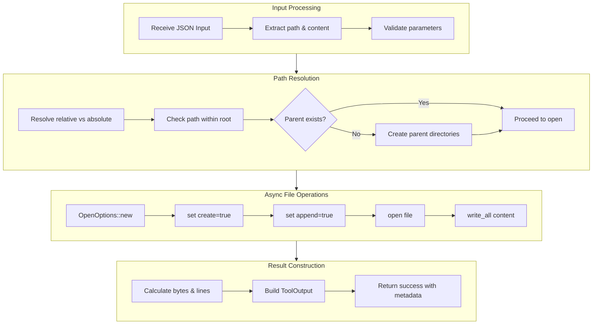

# AppendFileTool

**Type:** technology

### From: append_file

AppendFileTool is a Rust struct that implements the `Tool` trait, providing a standardized interface for AI agents to append text content to files. The struct itself is a zero-sized type (unit struct) that serves as a marker for the tool implementation, with all functionality provided through the trait implementation. This design pattern is common in plugin architectures where the type itself carries no state but defines behavior through trait methods.

The tool is designed with efficiency and safety as primary concerns. Unlike file rewriting operations that require reading entire file contents into memory, appending allows agents to incrementally build files with minimal overhead. This is particularly important for log aggregation, report generation, and other tasks where content accumulates over time. The implementation uses Tokio's asynchronous file operations, ensuring that the agent can perform other tasks while waiting for I/O to complete.

The tool integrates with a broader permission system through the `permission_category` method, returning `"file:write"` to indicate that this tool requires write access to the file system. This allows the agent framework to implement fine-grained access control, potentially restricting tool usage based on security policies or user preferences. The structured output includes both human-readable content and machine-readable metadata, enabling downstream components to track file modifications accurately.

## Diagram

## External Resources

- [Tokio OpenOptions documentation for async file operations](https://docs.rs/tokio/latest/tokio/fs/struct.OpenOptions.html) - Tokio OpenOptions documentation for async file operations
- [async-trait crate documentation for async methods in traits](https://rust-lang.github.io/async-trait/) - async-trait crate documentation for async methods in traits

## Sources

- [append_file](../sources/append-file.md)
