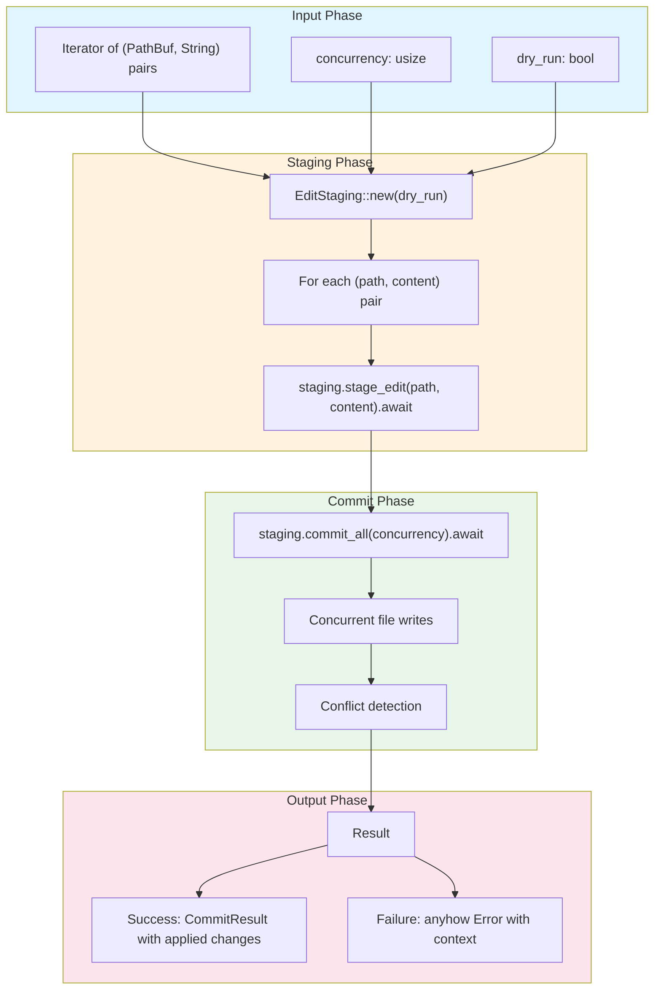

# apply_batch_edits

**Type:** technology

### From: api

The `apply_batch_edits` function is a public asynchronous API entry point in the ragent-core crate's file operations module. It serves as the primary interface for tools and skills to perform batch file modifications with controlled concurrency. The function abstracts over a complex staging and commit workflow, providing callers with a simple interface that accepts path-content pairs and handles all the underlying complexity of concurrent file I/O. Its design reflects modern Rust async patterns and emphasizes safety through dry-run capabilities and comprehensive error propagation.

The function signature demonstrates thoughtful API design: it accepts a generic iterator of tuples containing `PathBuf` and `String` content, allowing flexible input from various sources. The `concurrency` parameter enables callers to tune performance characteristics based on their specific I/O environment and system constraints. The `dry_run` flag provides a crucial safety mechanism for testing changes without permanent effects, which is especially important in automated agent systems where unintended modifications could have significant consequences. The return type of `Result<CommitResult>` provides structured information about the operation's outcome through the `anyhow` error handling ecosystem.

The implementation follows a clear three-phase pattern: initialization of the staging environment, iterative staging of individual edits, and concurrent commit execution. This separation of concerns allows for potential future extensions such as transaction rollback capabilities, validation hooks, or progress reporting. The use of `await` at each asynchronous boundary ensures proper cooperation with the async runtime while maintaining clear error propagation paths. The function's placement in a dedicated `api.rs` module signals its role as a stable public interface, suggesting that internal implementation details may evolve while this API contract remains consistent.

## Diagram

## External Resources

- [anyhow::Result type for flexible error handling in Rust](https://docs.rs/anyhow/latest/anyhow/type.Result.html) - anyhow::Result type for flexible error handling in Rust
- [std::path::PathBuf - owned, mutable path type](https://doc.rust-lang.org/std/path/struct.PathBuf.html) - std::path::PathBuf - owned, mutable path type

## Sources

- [api](../sources/api.md)
