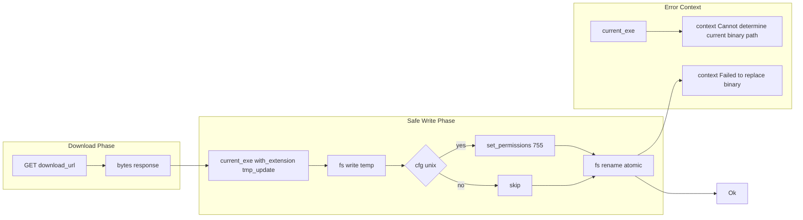

# Atomic File Replacement

**Type:** technology

### From: mod

Atomic file replacement is a systems programming technique used by ragent's updater to ensure binary updates occur safely without leaving the system in an inconsistent state. The implementation follows a write-to-temporary-then-rename pattern: the new binary is first written to a temporary file with the '.tmp_update' extension adjacent to the current executable, permissions are set appropriately on Unix systems (mode 755), and finally the temporary file is renamed to replace the original binary. The rename operation is atomic on POSIX-compliant systems, meaning it either completes entirely or not at all, preventing scenarios where a partially written file could corrupt the installation. This approach also preserves the original binary until the new one is fully downloaded and verified, allowing for rollback if the rename fails. The technique requires careful handling of file paths, permissions, and potential permission escalation scenarios where the user may not have write access to the binary location.

## Diagram

## External Resources

- [Rust standard library documentation for fs::rename atomicity](https://doc.rust-lang.org/std/fs/fn.rename.html) - Rust standard library documentation for fs::rename atomicity
- [Linux rename(2) system call documentation describing atomic behavior](https://man7.org/linux/man-pages/man2/rename.2.html) - Linux rename(2) system call documentation describing atomic behavior

## Sources

- [mod](../sources/mod.md)
