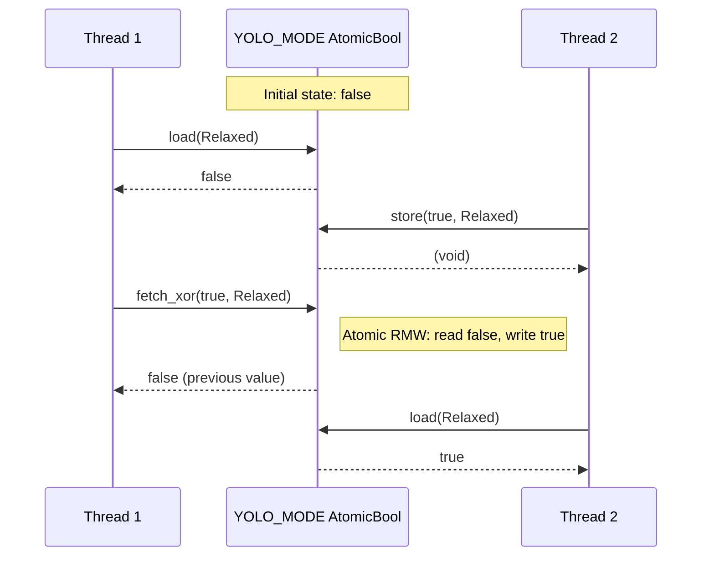

# AtomicBool

**Type:** technology

### From: yolo

AtomicBool is a Rust standard library type providing thread-safe, lock-free boolean operations for concurrent programming. In the YOLO mode implementation, it serves as the fundamental synchronization primitive for maintaining global state across potentially multiple threads without requiring expensive mutex acquisition. The `std::sync::atomic` module provides atomic types that map directly to processor-level atomic instructions, ensuring operations complete indivisibly even when multiple threads access the same memory location simultaneously.

The specific operations used in this implementation demonstrate the versatility of atomic primitives. The `load(Ordering::Relaxed)` operation in `is_enabled()` performs a simple read with minimal synchronization overhead, appropriate when only visibility is required. The `store(enabled, Ordering::Relaxed)` in `set_enabled()` writes the new value atomically. Most interestingly, `fetch_xor(true, Ordering::Relaxed)` in `toggle()` performs an atomic read-modify-write operation, inverting the boolean and returning the previous value in a single indivisible step—eliminating race conditions that would occur with separate read and write operations. This pattern is essential for implementing lock-free data structures and state machines.

AtomicBool's memory ordering parameter allows programmers to trade performance for synchronization strength. The `Relaxed` ordering used here provides no happens-before guarantees between threads but ensures atomicity and visibility, making it ideal for simple flags where precise sequencing isn't critical. Stronger orderings like `Acquire`, `Release`, or `SeqCst` provide progressively stricter memory ordering guarantees at the cost of potential performance degradation due to processor-level memory barrier instructions. Rust's atomic system, inherited from C++11's memory model, gives systems programmers fine-grained control over these trade-offs while maintaining memory safety through the type system.

## Diagram

## External Resources

- [Rust AtomicBool API documentation](https://doc.rust-lang.org/std/sync/atomic/struct.AtomicBool.html) - Rust AtomicBool API documentation
- [Rustonomicon chapter on atomics and memory ordering](https://doc.rust-lang.org/nomicon/atomics.html) - Rustonomicon chapter on atomics and memory ordering
- [C++ memory ordering - foundational concepts for Rust's model](https://en.cppreference.com/w/cpp/atomic/memory_order) - C++ memory ordering - foundational concepts for Rust's model

## Sources

- [yolo](../sources/yolo.md)
