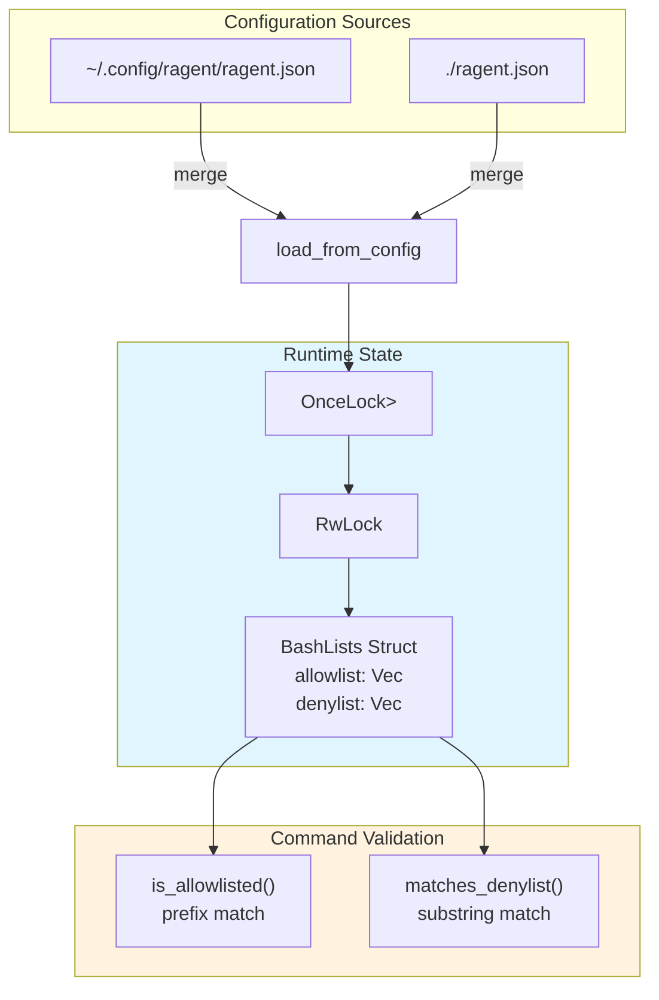

# BashLists

**Type:** technology

### From: bash_lists

BashLists is the central data structure in ragent's security subsystem, representing an in-memory snapshot of merged bash execution policies. This struct maintains two vectors of strings: an allowlist containing command prefixes that bypass standard security checks, and a denylist containing substring patterns that trigger unconditional command rejection. The design prioritizes read performance for the validation hot path, using immutable snapshots that can be cloned and checked without holding locks. The struct derives Debug, Clone, and Default, enabling easy inspection, duplication, and initialization with empty policies.

The struct serves as the source of truth for runtime security decisions, populated at startup from merged configuration sources and mutated through slash commands like `/bash add` and `/bash remove`. Its separation of allowlist (exact prefix matching on first token) and denylist (substring matching anywhere in command) reflects two distinct security philosophies: explicit trust delegation versus explicit threat blocking. This dual-list approach allows nuanced policies like 'trust curl generally but deny any command containing --insecure'. The in-memory representation uses Vec<String> rather than more sophisticated data structures, prioritizing simplicity and JSON serialization compatibility over query optimization, appropriate given typical list sizes in the dozens rather than thousands of entries.

## Diagram

## External Resources

- [Rust Vec documentation - the growable array type used for allowlist and denylist storage](https://doc.rust-lang.org/std/vec/struct.Vec.html) - Rust Vec documentation - the growable array type used for allowlist and denylist storage
- [Serde serialization framework used for JSON config persistence](https://serde.rs/) - Serde serialization framework used for JSON config persistence

## Sources

- [bash_lists](../sources/bash-lists.md)
