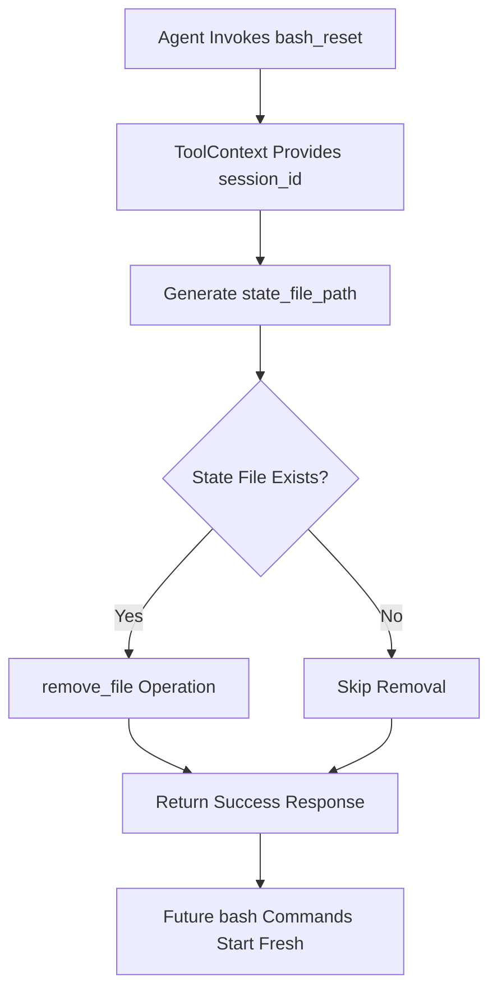

# BashResetTool

**Type:** technology

### From: bash_reset

BashResetTool is a Rust struct that implements the `Tool` trait to provide persistent shell state reset functionality within the ragent-core agent framework. This struct serves as the concrete implementation of a reset mechanism that allows AI agents to recover from problematic shell states during long-running sessions. The tool operates by removing a session-specific state file that maintains continuity of working directory and environment variables across multiple bash command executions.

The architectural significance of BashResetTool lies in its role as a state recovery mechanism within the broader bash execution subsystem. Unlike transient tools that perform computations and return results, BashResetTool modifies persistent state on the filesystem, creating a clear boundary between session history and future execution context. This design enables agents to engage in exploratory operations—navigating directory structures, modifying environment variables, sourcing configuration files—with the confidence that a clean state can be restored when needed.

The implementation leverages Rust's ownership and error handling models through the `anyhow::Result` type, ensuring that filesystem operations are handled safely. The tool's integration with the async runtime via `#[async_trait::async_trait]` demonstrates modern Rust patterns for I/O-bound operations, even though the underlying filesystem operations are synchronous. This async compatibility ensures consistency with other tools in the ecosystem that may perform network or other asynchronous operations.

## Diagram

## External Resources

- [async-trait crate documentation for understanding the async trait pattern used](https://docs.rs/async-trait/latest/async_trait/) - async-trait crate documentation for understanding the async trait pattern used
- [Rust standard library documentation for remove_file, the core filesystem operation](https://doc.rust-lang.org/std/fs/fn.remove_file.html) - Rust standard library documentation for remove_file, the core filesystem operation

## Sources

- [bash_reset](../sources/bash-reset.md)
