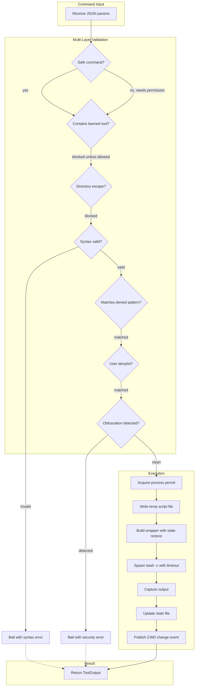

# BashTool

**Type:** product

### From: bash

BashTool is the central component of the RAgent system's shell execution capabilities, implemented as a Rust struct that implements the Tool trait for integration into the broader agent framework. This tool provides AI agents with the ability to execute arbitrary shell commands through bash, returning combined stdout and stderr output with configurable timeouts and comprehensive safety controls. The implementation represents a sophisticated balance between empowering AI agents with full shell access and protecting the host system from malicious or accidental damage. The tool manages persistent shell state across invocations through a clever file-based mechanism, writing state to `/tmp/ragent_shell_{session_id}.state` after each command to preserve working directory and exported environment variables. This persistence enables natural shell workflows where commands like `cd subdir` and `export VAR=value` survive between separate tool invocations, which is essential for realistic development workflows.

The security architecture of BashTool is multi-layered and defense-in-depth. At the outermost layer, commands are checked against SAFE_COMMANDS, a whitelist of benign operations like file listing, git operations, and build tools that can be auto-approved without user prompting. The matching is prefix-based, allowing variants like `ls -la` or `git status` while maintaining safety. The second layer blocks BANNED_COMMANDS entirely—including network tools like curl and wget, attack tools like nmap and metasploit, and packet analyzers—unless explicitly allowlisted by the user or YOLO mode is enabled. A third layer pattern-matches against DENIED_PATTERNS, which contains dangerous operation signatures like `rm -rf /`, fork bombs, disk destruction commands, and credential exfiltration attempts. The fourth layer validates bash syntax before execution using `sh -n`, preventing execution of malformed commands. The fifth layer detects directory escape attempts, preventing `cd ..` or absolute path navigation outside the working directory. Finally, a user-configurable denylist and obfuscation detection provide customizable protection against evasion attempts.

The execution flow of BashTool demonstrates careful attention to both security and usability. When a command is received, it passes through successive validation gates before spawning a process through Tokio's async Command API with timeout protection. The actual execution uses a wrapper script technique: the user's command is written to a temporary file, then executed within a state-restoration context that sources the previous session's environment, runs the command, captures the new state, and cleans up. This approach avoids shell injection vulnerabilities that could arise from direct command string interpolation while maintaining full shell feature compatibility. Output is captured with a 100KB truncation limit to prevent context window flooding. The implementation includes detailed tracing instrumentation for observability, logging command execution with secret redaction, approval decisions, and security violations.

## Diagram

## External Resources

- [Tokio process management documentation for async command execution](https://tokio.rs/tokio/tutorial/process) - Tokio process management documentation for async command execution
- [OWASP Command Injection attack patterns and defenses](https://owasp.org/www-community/attacks/Command_Injection) - OWASP Command Injection attack patterns and defenses
- [Serde JSON Value type for parameter schema handling](https://docs.rs/serde_json/latest/serde_json/struct.Value.html) - Serde JSON Value type for parameter schema handling

## Sources

- [bash](../sources/bash.md)
