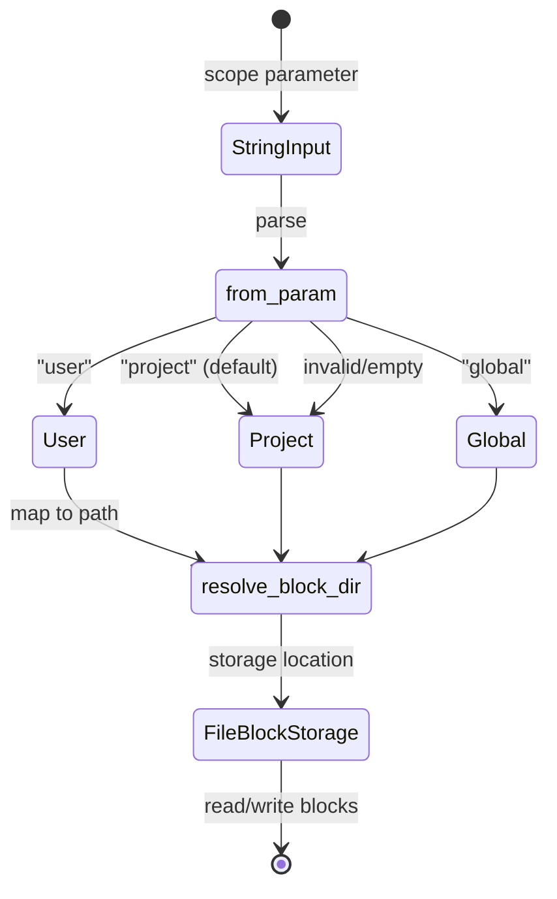

# BlockScope

**Type:** technology

### From: memory_migrate

BlockScope is a fundamental abstraction in the ragent memory system that defines the contextual boundaries and visibility of memory blocks across different operational domains. This enum or struct type—evidenced by its usage with methods like `from_param()` and `as_str()`—establishes a three-tier hierarchy encompassing user-scoped, project-scoped, and globally-scoped memory, each with distinct semantics for data isolation and sharing. The scope system mirrors patterns found in development environment configurations, package management systems, and modern secret management tools like HashiCorp Vault or AWS Secrets Manager, where hierarchical scoping enables both flexibility and security.

The user scope typically encompasses personal preferences, learned behaviors, and cross-project knowledge that should persist across different agent sessions and projects. Project scope represents the most common default, capturing domain-specific information, codebase context, and task-oriented memories that are relevant only within a specific project boundary. The global scope provides system-wide defaults and shared knowledge bases that transcend individual users and projects, enabling consistent behavior across an organization's agent deployments. This three-tier model elegantly balances personalization with standardization, allowing agents to draw from appropriate context layers without overwhelming the working memory with irrelevant information.

The implementation of BlockScope demonstrates sophisticated Rust patterns for type-safe enumeration handling, with the `from_param` method providing robust string-to-enum conversion that gracefully handles invalid inputs through `unwrap_or` fallback semantics. The `resolve_block_dir` function maps these abstract scopes to concrete filesystem paths, suggesting a directory structure that physically separates scope domains—perhaps through nested directories or naming conventions that prevent accidental cross-scope access. This physical isolation reinforces logical boundaries, making the scope system auditable and enabling fine-grained backup and migration strategies.

In production AI agent systems, scope management directly impacts security, privacy, and compliance postures. User-scoped memories may contain personal information subject to GDPR or CCPA regulations, requiring different retention and deletion policies than project-scoped technical documentation. Global scopes might contain licensed content or proprietary algorithms with restricted distribution. The BlockScope abstraction enables these concerns to be addressed systematically, with scope-aware logging, access control, and encryption policies that apply consistently across the memory subsystem.

## Diagram

## External Resources

- [Rust enums and pattern matching documentation](https://doc.rust-lang.org/book/ch06-00-enums.html) - Rust enums and pattern matching documentation
- [Twelve-Factor App configuration methodology](https://12factor.net/config) - Twelve-Factor App configuration methodology
- [HashiCorp Vault secrets engine concepts](https://developer.hashicorp.com/vault/docs/concepts/secrets-engine) - HashiCorp Vault secrets engine concepts

## Sources

- [memory_migrate](../sources/memory-migrate.md)

### From: compact

BlockScope is an enumeration that distinguishes between two fundamental organizational contexts for memory blocks: Project-scoped blocks that contain context specific to an individual codebase or working directory, and Global-scoped blocks that apply universally across all sessions and projects. This scoping mechanism enables the ragent system to maintain separation between generic knowledge and project-specific expertise, preventing context leakage while allowing appropriate reuse of broadly applicable memories. The compaction system iterates over both scope variants during block maintenance, applying size limits and truncation policies consistently regardless of scope while preserving the organizational boundary. Project-scoped blocks typically contain implementation details, architectural decisions, and domain-specific patterns relevant to a particular codebase, while Global blocks might store programming language idioms, framework documentation summaries, and universal best practices. The scope abstraction supports multi-project deployments where a single ragent instance manages memories across diverse codebases without inappropriate cross-pollination.
