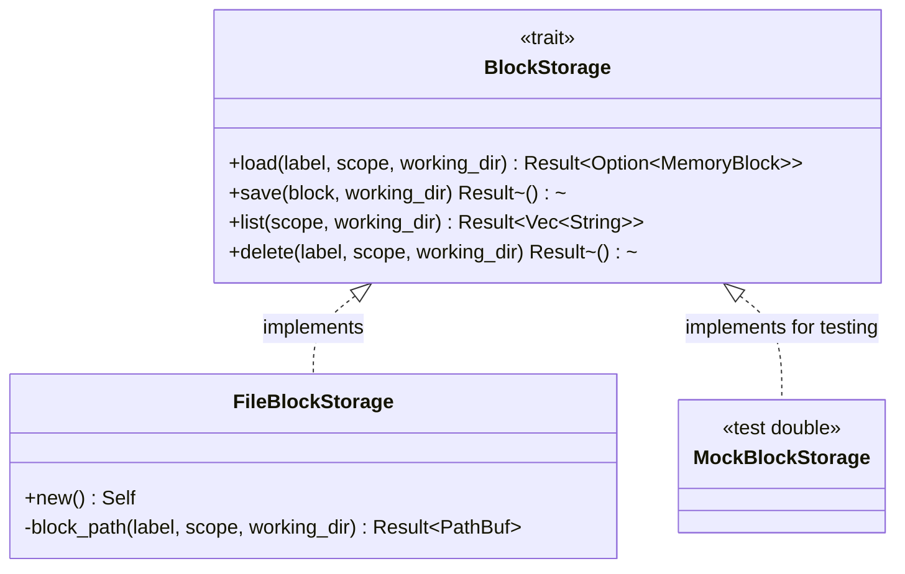

# BlockStorage

**Type:** technology

### From: storage

BlockStorage is a trait that defines the abstract interface for memory block persistence operations in the ragent memory system. This trait establishes a contract for storage implementations, enabling polymorphic usage where different backend implementations can be substituted without changing client code. The trait specifies four core operations: loading blocks by label and scope, saving blocks with content limit enforcement, listing all block labels in a scope, and deleting blocks by label and scope. Each operation is designed to be synchronous, reflecting the expectation of small, local file I/O operations rather than network-bound or high-latency storage.

The trait is carefully designed with object safety in mind, achieved by avoiding generic type parameters and using trait objects (`&dyn BlockStorage`) in function signatures like `load_all_blocks`. Object safety enables crucial architectural patterns including dependency injection for testing, where mock implementations can substitute for real file storage without requiring generics or monomorphization. The trait also requires `Send + Sync` bounds, ensuring implementations are safe to share between threads, which is essential for concurrent access patterns in asynchronous Rust applications. These design decisions reflect mature engineering practices for building testable, concurrent-safe storage abstractions.

The trait's method signatures incorporate Rust's error handling idioms through the `anyhow::Result` type, providing flexibility for implementations to return rich error context while allowing callers to handle errors uniformly. The load method returns `Result<Option<MemoryBlock>>` rather than failing on missing files, distinguishing between "file not found" (success with None) and actual I/O errors (Err). This design prevents unnecessary error handling for expected cases while preserving error information for genuine problems. The scope parameter in all methods enables the dual-scope architecture, with `BlockScope` distinguishing between project-local and global storage locations.

## Diagram

## External Resources

- [Rust object safety rules for trait objects](https://doc.rust-lang.org/reference/items/traits.html#object-safety) - Rust object safety rules for trait objects
- [Send trait documentation for thread-safe ownership transfer](https://doc.rust-lang.org/std/marker/trait.Send.html) - Send trait documentation for thread-safe ownership transfer
- [Sync trait documentation for thread-safe references](https://doc.rust-lang.org/std/marker/trait.Sync.html) - Sync trait documentation for thread-safe references

## Sources

- [storage](../sources/storage.md)

### From: import_export

BlockStorage is a core abstraction in ragent's memory system representing the file-based persistence layer for memory blocks, distinct from the SQLite-backed structured memory store. This trait-based interface (evidenced by &dyn BlockStorage parameters throughout import_export.rs) enables polymorphic storage backends while maintaining consistent semantics for block operations. The abstraction supports operations including list (enumerate block labels by scope), load (retrieve block content), and save (persist block data), with scope-aware behavior distinguishing between project-local and global blocks.

The file-based block storage approach addresses specific requirements that complement ragent's structured SQLite storage. Blocks typically contain larger content units—code snippets, documentation excerpts, architectural decision records—that benefit from direct file system storage rather than relational normalization. The dual-scope design (BlockScope::Project versus BlockScope::Global) enables contextual memory organization where project-specific blocks remain associated with particular codebases while global blocks provide cross-project knowledge sharing. This scoping also facilitates granular export/import operations, as demonstrated by separate counters and handling paths in the import result structures.

The trait object pattern (&dyn BlockStorage) used throughout the import/export functions enables testability and backend flexibility. The test module leverages FileBlockStorage, a concrete implementation, while production code could theoretically support alternative backends such as cloud object storage, encrypted local storage, or version-controlled repositories. The working_dir parameter threading through all operations establishes the project context anchor, enabling relative path resolution and scope-appropriate storage location determination. This design supports ragent's distributed usage model where the same agent binary operates across multiple projects with isolated project blocks and shared global knowledge.
