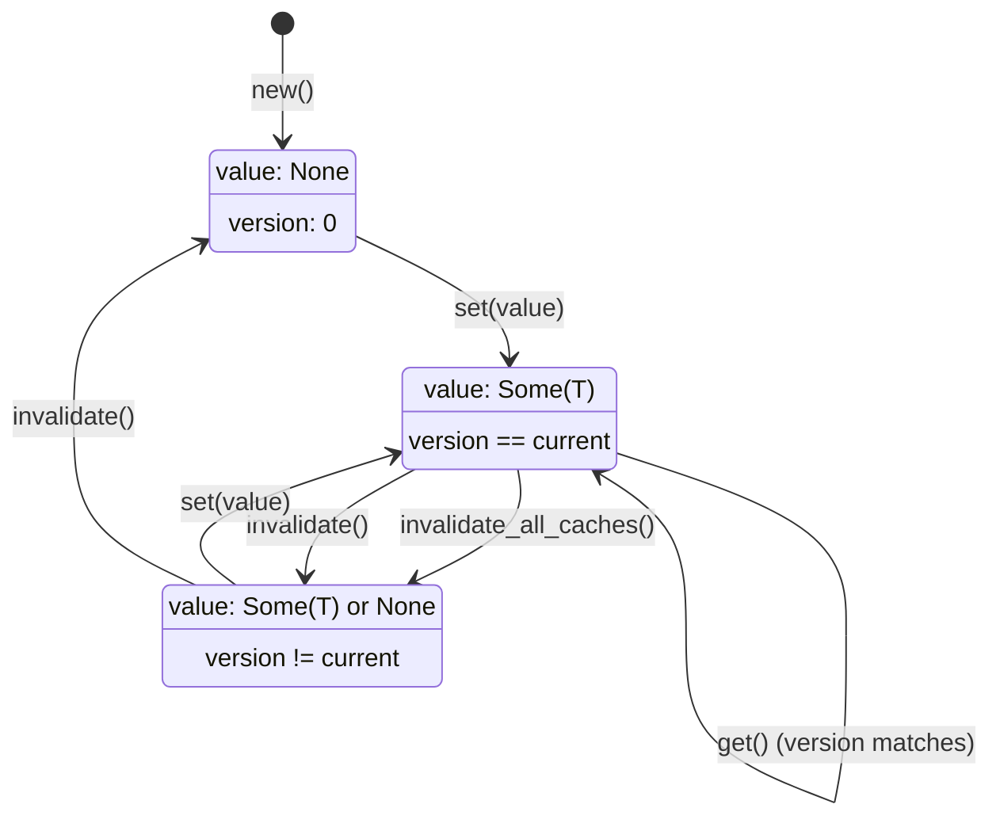

# Cached<T>

**Type:** technology

### From: cache

The Cached<T> generic struct serves as the fundamental building block for versioned caching throughout the ragent-core session system. This lightweight, generic container wraps any cloneable type T with metadata for cache validity tracking, implementing a time-to-live pattern based on global version counters rather than timestamps. The struct contains three fields: an optional value, a version number indicating when the cache was last populated, and a generation counter that increments on each invalidation.

The design philosophy behind Cached<T> prioritizes simplicity and correctness over sophisticated caching policies. Rather than implementing complex eviction strategies or memory pressure handling, it relies on explicit invalidation through version mismatches. When `invalidate_all_caches()` is called, it increments a global atomic counter; any Cached<T> instance with a version number different from the current global version is considered stale. This approach eliminates the need for distributed cache coordination or complex dependency tracking at the individual cache entry level.

The implementation provides a clean API surface with methods for cache lifecycle management. The `is_valid()` method checks both value presence and version equality, while `get()` returns a cloned value only if valid. The `set()` method captures the current global version when storing new values, and `invalidate()` clears the value while bumping the generation counter for debugging purposes. The requirement that T: Clone enables safe sharing of cached values across the system without ownership complications. This struct is used extensively within SystemPromptCache for individual component caching and could be reused for other versioned caching needs throughout the codebase.

## Diagram

## External Resources

- [Rust Clone trait for duplication semantics](https://doc.rust-lang.org/std/clone/trait.Clone.html) - Rust Clone trait for duplication semantics
- [Rust Option type for nullable values](https://doc.rust-lang.org/std/option/enum.Option.html) - Rust Option type for nullable values
- [Rust patterns for compact data structures](https://matklad.github.io/2022/07/24/bit-fields.html) - Rust patterns for compact data structures

## Sources

- [cache](../sources/cache.md)
