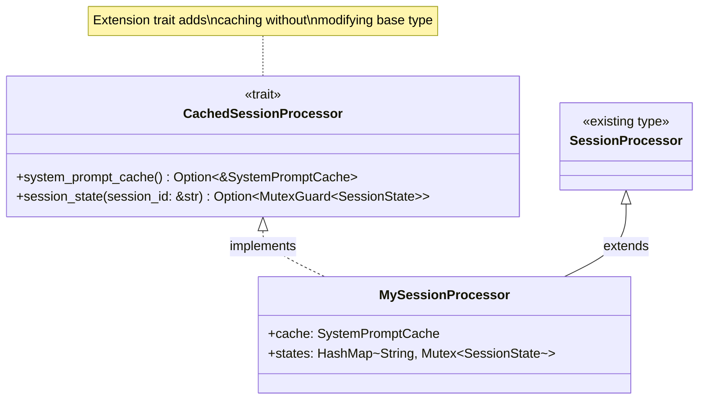

# CachedSessionProcessor

**Type:** technology

### From: cache

The CachedSessionProcessor trait defines an extension interface for adding caching capabilities to existing session processor implementations without requiring structural changes to their core logic. This trait-based approach follows the open/closed principle of software design, allowing new functionality to be added through extension rather than modification. The trait provides two key methods: `system_prompt_cache()` for accessing the shared system prompt cache, and `session_state()` for retrieving per-session state with proper synchronization.

The design recognizes that session processors in the ragent architecture may have different caching requirements and storage capabilities. By defining these capabilities as a trait rather than concrete struct fields, the system accommodates varying implementations—some processors might maintain their own caches, while others might share global cache instances. The `system_prompt_cache()` method returns an optional reference, acknowledging that not all processors require system prompt caching or may operate in contexts where caching is disabled.

The `session_state()` method is particularly notable for its use of `std::sync::MutexGuard` in the return type, explicitly encoding the synchronization contract in the type system. Callers receive a mutex guard that ensures exclusive access to the session state for the duration of the guard's lifetime, preventing data races in concurrent scenarios. The string-based session ID lookup enables dynamic session discovery in multi-session environments. This trait pattern enables the caching infrastructure to be layered onto the existing session processing architecture while maintaining type safety and explicit concurrency semantics.

## Diagram

## External Resources

- [Rust book chapter on traits and trait objects](https://doc.rust-lang.org/book/ch10-02-traits.html) - Rust book chapter on traits and trait objects
- [Rust design patterns: Extension Traits](https://rust-unofficial.github.io/patterns/patterns/behavioural/extension-traits.html) - Rust design patterns: Extension Traits
- [Open/closed principle in software design](https://en.wikipedia.org/wiki/Open%E2%80%93closed_principle) - Open/closed principle in software design

## Sources

- [cache](../sources/cache.md)
