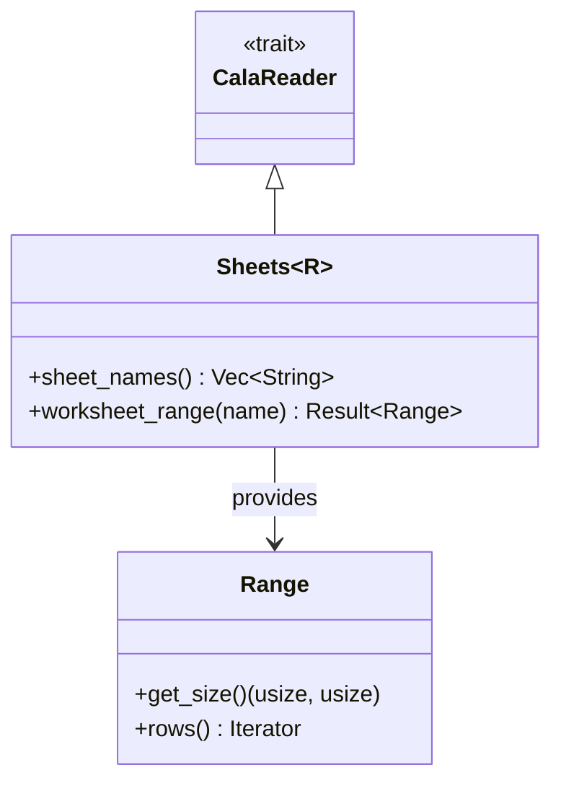

# calamine

**Type:** technology

### From: libreoffice_info

calamine is a Rust crate designed for reading Excel and OpenDocument Spreadsheet (ODS) files with a focus on performance and minimal memory footprint. It provides a streaming API that allows processing large spreadsheets without loading entire files into memory, making it particularly valuable for server-side applications and data processing pipelines. The crate abstracts over multiple spreadsheet formats, offering a unified interface for XLSX, XLSB, XLS, and ODS files, which simplifies application code that needs to support heterogeneous document sources.

In the context of LibreInfoTool, calamine serves as the primary engine for ODS processing. The `open_workbook_auto` function detects the file format automatically and returns a `Sheets` struct that provides access to worksheet metadata and data ranges. The API follows Rust's ownership patterns carefully, requiring mutable access to iterate through worksheets while allowing shared access to sheet names. This design enables efficient enumeration of spreadsheet structure—specifically the `sheet_names()` method and `worksheet_range()` with `get_size()` for dimension extraction—without materializing cell values unless explicitly requested.

calamine's error handling integrates well with Rust's `Result` type, producing descriptive errors for common failure modes like corrupt files, password-protected documents, or unsupported format features. The crate has gained significant adoption in the Rust data processing ecosystem as a reliable alternative to heavier solutions that require external dependencies or runtime environments. Its pure-Rust implementation ensures cross-platform compatibility and simplifies deployment in containerized environments.

## Diagram

## External Resources

- [calamine GitHub repository](https://github.com/tafia/calamine) - calamine GitHub repository
- [calamine API documentation](https://docs.rs/calamine/latest/calamine/) - calamine API documentation

## Sources

- [libreoffice_info](../sources/libreoffice-info.md)

### From: libreoffice_read

Calamine is a mature Rust library for reading spreadsheet formats including Excel (XLS, XLSX, XLSM) and OpenDocument Spreadsheet (ODS) files, serving as the primary parsing engine for spreadsheet operations in LibreReadTool. The library distinguishes itself through native format support rather than relying on external dependencies or COM automation, making it particularly suitable for server-side and embedded applications. In the context of this implementation, calamine provides the `Sheets` and `Reader` types that enable comprehensive ODS handling including automatic workbook detection, sheet enumeration, named sheet resolution, and cell range extraction. The library's API design follows Rust's iterator patterns, allowing memory-efficient processing of large spreadsheets through lazy evaluation of row data. Calamine's ODS support specifically handles the complex internal structure of OpenDocument files, including the XML-based table definitions, cell value types (string, numeric, date, boolean), and formula expressions. The integration in `read_ods()` demonstrates advanced usage patterns including dynamic sheet selection by name or index, A1:B2 range parsing with coordinate transformation, and flexible output formatting. The library's error handling integrates cleanly with `anyhow` through `with_context()` calls, providing meaningful error messages when workbooks cannot be opened or sheets are not found. Calamine's continued development and widespread adoption in the Rust ecosystem make it a reliable foundation for production spreadsheet processing tasks, with performance characteristics suitable for high-throughput document processing pipelines.
