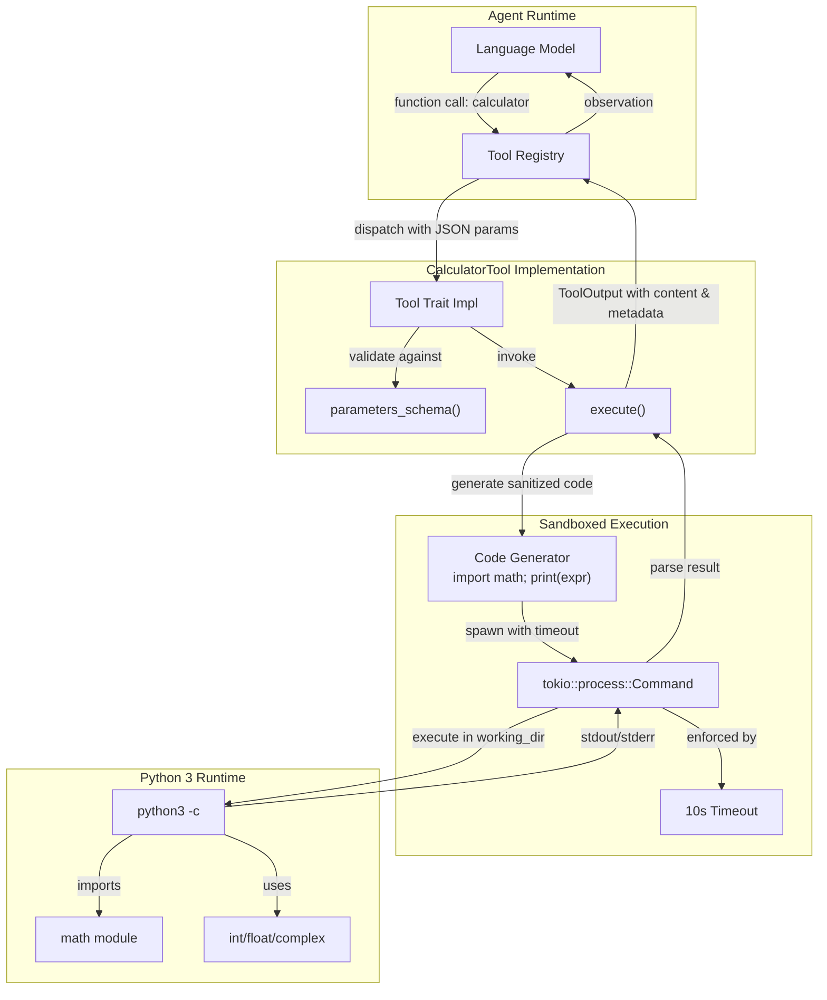

# CalculatorTool

**Type:** technology

### From: calculator

CalculatorTool is a Rust struct implementing the `Tool` trait, designed to evaluate mathematical expressions within an agent-based AI system. Rather than parsing and evaluating expressions natively in Rust, the tool delegates computation to a Python 3 subprocess, specifically constructing code that imports the `math` module and prints the evaluation result. This architectural choice provides immediate access to Python's mature and well-tested numeric implementations, including support for arbitrarily large integers through Python's automatic big integer handling, full IEEE 754 floating-point compliance, native complex number arithmetic, and the extensive functions available in Python's standard `math` library.

The tool was designed with security and reliability as primary concerns. The implementation restricts Python execution to a tightly controlled template: `import math; print({expr})`, which prevents arbitrary code execution while still permitting sophisticated mathematical operations. This sandboxing approach is complemented by a 10-second timeout enforced via `tokio::time::timeout`, preventing denial-of-service attacks through computationally expensive expressions like factorials of large numbers or infinite loops. The tool also respects the agent's working directory context, executing the Python process in the designated workspace to maintain filesystem isolation consistent with the broader agent security model.

CalculatorTool exemplifies a broader pattern in modern agent frameworks where capabilities are composed through well-defined interfaces rather than monolithic implementations. By implementing the `Tool` trait, it gains automatic integration with parameter validation (via JSON Schema), permission-based access control (through the `bash:execute` category), and standardized output formatting. The tool's description and examples are crafted to guide language model callers toward appropriate usage, documenting supported syntax like exponentiation (`2 ** 32`), module functions (`math.factorial(20)`), and complex numbers (`(3+4j) * 2`). This careful interface design reduces error rates and improves the reliability of agent-driven mathematical reasoning.

## Diagram

## External Resources

- [Python math module documentation - the standard library functions available to CalculatorTool expressions](https://docs.python.org/3/library/math.html) - Python math module documentation - the standard library functions available to CalculatorTool expressions
- [Serde serialization framework - powers the JSON Schema parameter definitions](https://serde.rs/) - Serde serialization framework - powers the JSON Schema parameter definitions
- [Tokio process module - async subprocess management used for Python execution](https://docs.rs/tokio/latest/tokio/process/) - Tokio process module - async subprocess management used for Python execution

## Sources

- [calculator](../sources/calculator.md)
