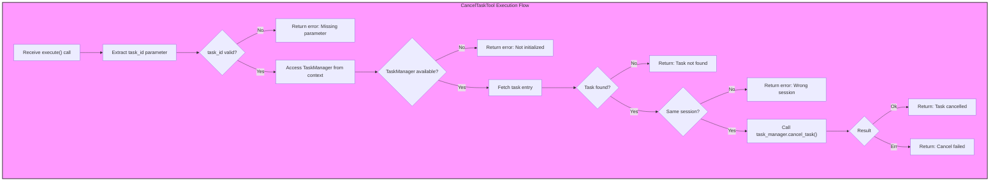

# CancelTaskTool

**Type:** technology

### From: cancel_task

The `CancelTaskTool` is a concrete implementation of the `Tool` trait within the ragent-core framework, designed specifically for terminating background sub-agent tasks that were previously spawned with asynchronous execution enabled. This tool exemplifies the plugin-based architecture of the ragent system, where capabilities are modularized into discrete tool implementations that can be dynamically invoked by agents during their execution. The tool requires a single parameter—the `task_id` returned when a task was originally created—and enforces strict access controls by verifying that the requesting session matches the parent session of the target task. This security model prevents cross-session interference while enabling legitimate task lifecycle management within multi-agent systems. The implementation leverages Rust's async/await patterns for non-blocking execution and integrates deeply with the framework's error propagation mechanisms to provide clear feedback about cancellation success or failure states.

## Diagram

## External Resources

- [anyhow crate documentation for flexible error handling in Rust](https://docs.rs/anyhow/latest/anyhow/) - anyhow crate documentation for flexible error handling in Rust
- [serde_json for JSON serialization and schema generation](https://serde.rs/) - serde_json for JSON serialization and schema generation

## Sources

- [cancel_task](../sources/cancel-task.md)
