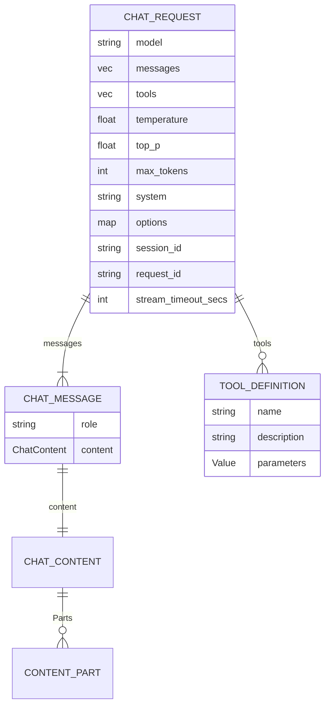

# ChatRequest

**Type:** technology

### From: mod

The `ChatRequest` struct encapsulates all parameters needed to initiate a chat completion request, serving as the primary input to `LlmClient` implementations. This carefully designed structure balances standardization across providers with extensibility for provider-specific features. The core fields include `model: String` for provider-specific model identifiers (e.g., "gpt-4o", "claude-3-5-sonnet-20241022"), `messages: Vec<ChatMessage>` for conversation history, and `tools: Vec<ToolDefinition>` for available function-calling capabilities. Sampling controls through `temperature: Option<f32>`, `top_p: Option<f32>`, and `max_tokens: Option<u32>` follow established LLM API conventions while remaining optional for provider defaults.

Several fields demonstrate sophisticated operational design. The `system: Option<String>` field supports system prompts that guide model behavior, a pattern widely adopted since its introduction. The `options: HashMap<String, Value>` field with `#[serde(default)]` provides an escape hatch for provider-specific extensions—Anthropic's thinking budget controls, OpenAI's response format specifications, or custom parameters—without requiring struct changes. The `#[serde(skip)]` fields handle infrastructure concerns: `session_id` enables providers like GitHub Copilot to avoid re-billing identical requests; `request_id` supports distributed tracing; and `stream_timeout_secs` prevents indefinite blocking on stalled connections.

The struct derives both `Serialize` and `Deserialize` with `Debug` and `Clone`, supporting network transmission, configuration persistence, and inspection. The field ordering reflects typical usage patterns—model and messages first as required conceptual parameters, followed by optional tuning parameters, then infrastructure fields. This design enables ergonomic struct initialization while supporting complete provider feature coverage through the options map.

## Diagram

## External Resources

- [OpenAI Chat Completion API request parameters](https://platform.openai.com/docs/api-reference/chat/create) - OpenAI Chat Completion API request parameters
- [Anthropic Messages API request structure](https://docs.anthropic.com/en/api/messages) - Anthropic Messages API request structure
- [Serde field attributes documentation](https://serde.rs/field-attrs.html) - Serde field attributes documentation

## Sources

- [mod](../sources/mod.md)
