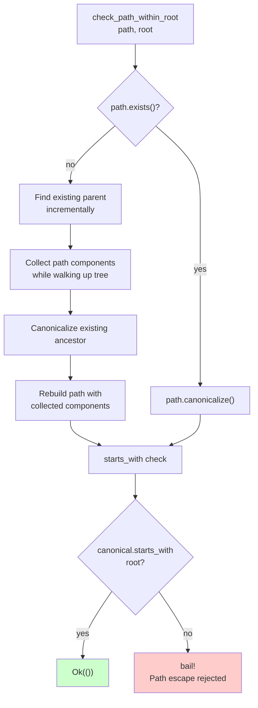

# check_path_within_root

**Type:** technology

### From: mod

The `check_path_within_root` function implements a critical security control preventing directory traversal attacks in file system operations. This function validates that a given path resolves to a location within a designated root directory after canonicalization, blocking attempts to access files outside the intended sandbox such as `../../etc/passwd` patterns. The implementation demonstrates sophisticated path handling for both existing and non-existing paths.

For existing paths, the function uses `canonicalize()` to resolve symbolic links and normalize the path, then checks if it starts with the canonicalized root. For non-existing paths, it implements an incremental parent traversal algorithm: it collects path components while walking up the directory tree until finding an existing ancestor, canonicalizes that ancestor, then reconstructs the target path by appending the collected components in reverse order. This handles the common case of creating new files in directories that don't yet exist.

The security model assumes that path canonicalization is trustworthy and that the root directory itself is properly secured. On validation failure, the function returns a descriptive error using `anyhow::bail!` that includes both the attempted path and the root boundary, aiding in debugging and security auditing. This function is foundational for the file operation tools, ensuring that even if an agent is prompted with malicious paths, the system enforces containment boundaries.

## Diagram

## External Resources

- [OWASP Path Traversal attack documentation and prevention](https://owasp.org/www-community/attacks/Path_Traversal) - OWASP Path Traversal attack documentation and prevention
- [Rust canonicalize documentation for path normalization](https://doc.rust-lang.org/std/fs/fn.canonicalize.html) - Rust canonicalize documentation for path normalization

## Sources

- [mod](../sources/mod.md)
